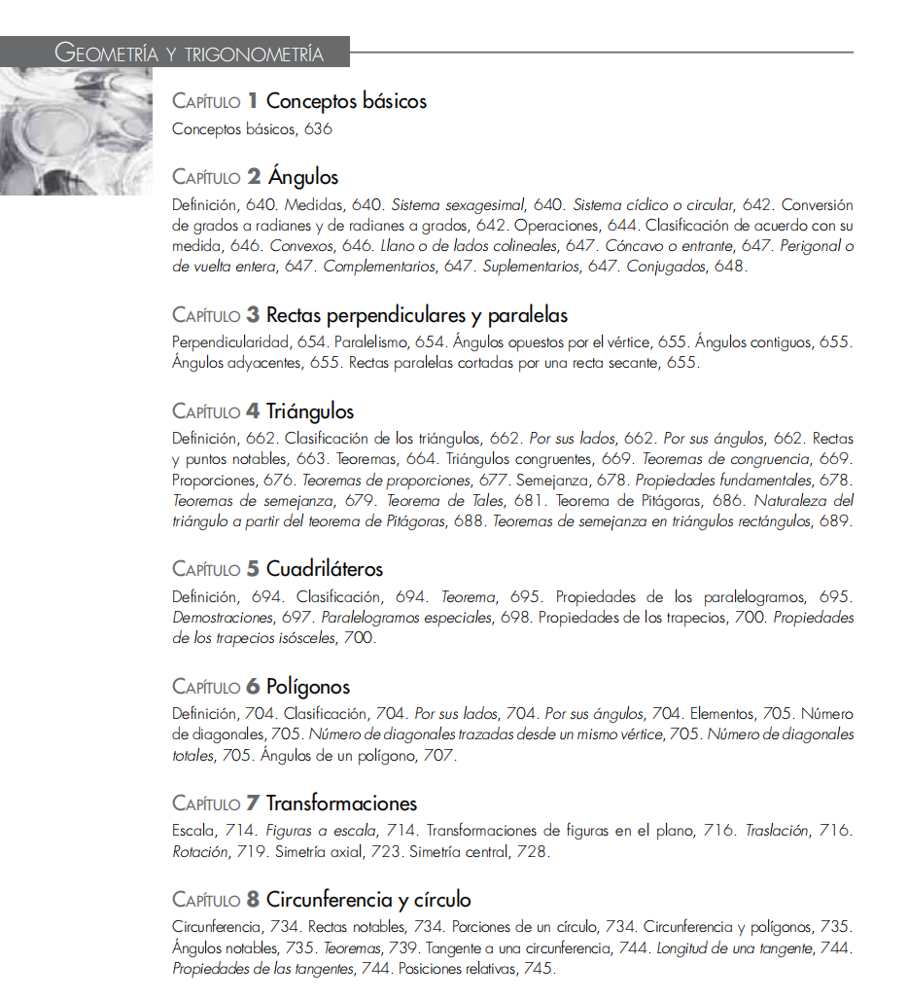
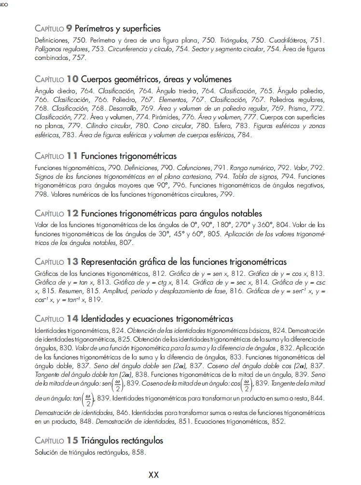
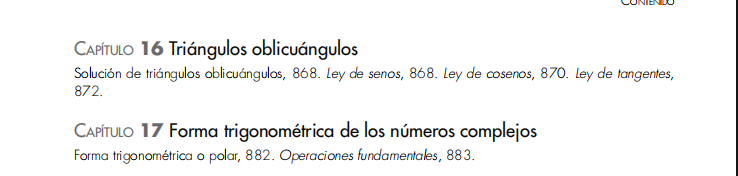

# CONTEXTO DEL PROYECTO

## Contexto general

### Tu rol
Me estás ayudando a generar las lecciones de clase que son archivos .md que se renderizan en mi página web. o puedes bien, tomar el rol de planeador docente para ayudarme a estructurar el árbol de carpetas y archivos .md que se van a generar. Así las cosas, tu rol puede ser dependiendo lo que te solicite, de generador de contenidos (lecciones .md), o de planeador docente (árbol de carpetas y archivos .md). O puedes también, una vez ya estén planeadas, generadas y aprobadas las lecciones, ayudarme con el componente gráfico, el cual se maneja a través de las librerías ECHARTS y JSXGRAPHS, ya instaladas, y para lo cual te vas a guiar lo que dice en .agent/workflows/graphics-context.md

Para la generación de gráficos por favor usar un Wrapper visual con las siguientes caracterísiticas: 
- 📊 Icono solo (sin texto)
- Fondo gris neutro #e2e8f0
- Borde sutil #cbd5e1
- Bordes redondeados 12px

Es importante también que si corresponde, le agregues título a los ejes de los gráficos.

### Estamos en fase de cliente docente
Ten en cuenta que ahora mismo estamos en plan no de programador del sitio sino de cliente docente que se encarga de generar los contenidos para la página web. Estos contenidos son cargados dentro de la carpeta src/content/.

### Estructura de carpetas y archivos
La carpeta src/content/ tiene unas materias, las cuales son matemáticas, física, química y ciencias. Cada materia tiene capítulos, cada capítulo tiene temas, y cada tema tiene lecciones. De modo que la división de carpetas y archivos sigue esta estructura, haciendo la claridad que cada archivo .md corresponde a una lección.

### Para la generación de las lecciones

#### Estilo de las lecciones

Fíjate por ejemplo en el estilo que manejan mis lecciones en la carpeta src/content/matematicas/01-aritmetica/05-proporcionalidad/03-regla-de-tres-simple.md, es decir, con un estilo sencillo, fácilmente entendible, progresivo, que trabaja una idea por vez, y la pone en práctica con ejemplos, y luego ahí sí trabaja con otra idea o subsección dentro de la misma lección.

#### Expresiones con latex
Ten en cuenta que estoy usando kathex para renderizar los archivos .md, por lo que las ecuaciones en bloque son del tipo

$$

$$

Las ecuaciones inline son del tipo $, al igual que las ecuaciones en tabla.

Esto es importante para que las ecuaciones se rendericen correctamente. No usar expresiones del tipo [] o () para las ecuaciones. Guíate de las expresiones que se usan en los archivos .md existentes, por ejemplo en la carpeta src/content/matematicas/01-aritmetica/02-teoria-de-numeros, o en la carpeta src/content/fisica/02-cinematica/02-escalares-y-vectores, por dar un ejemplo.

Por favor, en los títulos de cada sección de una lección, no les metas código de latex, ya que se renderiza mal (latex crudo), tanto en la tabla de contenidos como en la barra de navegación lateral. Así que por favor tenlo en cuenta.

#### Tener en cuenta

Para la elaboración de la lecciones, ten en cuenta que el una MATERIA > CAPITULO > TEMAS > LECCIÓN, y que en cada lección se abordan diferentes conceptos, los cuales quiero que los trabajes progresivamente, uno a uno, cosa que si empiezas uno, lo explicas por su definición o introducción, luego haces un par de ejemplos de ese concepto (o más si ves que es algo muy fácil, tipo identificar los elementos en una expresión algebraica), luego pasas al otro concepto dentro de esa lección, y luego haces un par de ejemplos de ese concepto, y luego pasas al siguiente concepto, y así sucesivamente. La idea es que al final cierres con una sección tipo, 2 ejercicios por concepto en una nueva sección de esa lección que se llame tipo "Ejercicios de práctica" o "Ejercicios para practicar", o el nombre que más adecuado encuentres.

LAS LECCIONES DEBE SER LO MÁS BRUTALMENTE ENTENDIBLES Y SIMPLES A LA VEZ, DE TAL FORMA QUE EL PROFESOR MÁS RESPETADO POR SU DIDÁCTICA EN EL COLEGIO LA SIGA AL PIE DE LA LETRA EN SU SECUENCIA, POR SUS ILUSTRACIONES Y CLARIDAD ABSOLUTA, MANEJANDO UN MÉTODO INTUITIVO DE INTRODUCIR LOS TEMAS, BASADO EN SITUACIONES REALES Y PRÁCTICAS, SIENDO PROGRESIVO E INDUCTIVO, REDONDEANDO IDEAS DE FORMA SISTEMÁTICA, SINTÉTICA Y CONCISA"

## Solicitud concreta

VAMOS A CREAR UN CAPÍTULO LLAMADO "GEOMETRÍA Y TRIGONOMETRÍA" O CÓMO AL FINAL DECIDAMOS CON BASE EN EL ANÁLISIS QUE PRIMERO VAS HACER DE FORMA EXHAUSTIVA COMO UN EXPERTO DOCENTE COLOMBIANO.

VAS A EVALUAR EL ORDEN DE LOS TEMAS QUE MANEJA UN LIBRO GUÍA QUE TE VOY A DEJAR. EN ESE SENTIDO, TÚ VAS A EVALUAR Y DEFINIR CUÁL ES EL ORDEN MÁS ADECUADO PARA UN ESTUDIANTE DE NIVEL ESCOLAR EN COLOMBIA, SIGUIENDO ESA FILOSOFÍA DE QUE "LAS LECCIONES DEBE SER LO MÁS BRUTALMENTE ENTENDIBLES Y SIMPLES A LA VEZ, DE TAL FORMA QUE EL PROFESOR MÁS RESPETADO POR SU DIDÁCTICA EN EL COLEGIO LA SIGA AL PIE DE LA LETRA EN SU SECUENCIA, POR SUS ILUSTRACIONES Y CLARIDAD ABSOLUTA, MANEJANDO UN MÉTODO INTUITIVO DE INTRODUCIR LOS TEMAS, BASADO EN SITUACIONES REALES Y PRÁCTICAS, SIENDO PROGRESIVO E INDUCTIVO, REDONDEANDO IDEAS DE FORMA SISTEMÁTICA Y CON CLARIDAD ABSOLUTA. TEN EN CUENTA: EXTREMADAMENTE FÁCILES DE ENTENDER, INTUITIVOS, PROGRESIVOS, INDUCTIVOS, SISTEMÁTICOS Y CONCISOS, REFORZANDO CON EJEMPLOS DE UN CONCEPTO HASTA AFIANZAR Y LUEGO PASAR A OTRO CONCEPTO EN LA MISMA LECCIÓN!!".

LOS TEMAS QUE PROPONE EL LIBRO (BAJO EL NOMBRE DE CAPÍTULOS EN SU CONVENCIÓN) SON:

Geometría Euclidiana
• Capítulo 1: Conceptos básicos
    ◦ Trata las definiciones fundamentales introductorias de la geometría.
• Capítulo 2: Ángulos
    ◦ Cubre la definición de ángulo, sistemas de medición (sistema sexagesimal y cíclico/circular), conversión entre grados y radianes, operaciones con ángulos y su clasificación de acuerdo con su medida (convexos, llanos, cóncavos, perigonales, complementarios, suplementarios y conjugados).
• Capítulo 3: Rectas perpendiculares y paralelas
    ◦ Aborda los conceptos de perpendicularidad y paralelismo, así como el estudio de los ángulos que se forman entre rectas (opuestos por el vértice, contiguos y adyacentes) y las propiedades de las rectas paralelas cortadas por una secante.
• Capítulo 4: Triángulos
    ◦ Se enfoca en la definición y clasificación de triángulos (por sus lados y ángulos). Estudia las rectas y puntos notables, teoremas de congruencia, proporciones, semejanza (incluyendo el Teorema de Tales) y el Teorema de Pitágoras.
• Capítulo 5: Cuadriláteros
    ◦ Examina la definición y clasificación de cuadriláteros. Analiza teoremas y propiedades específicas de paralelogramos y trapecios (incluyendo trapecios isósceles).
• Capítulo 6: Polígonos
    ◦ Trata sobre la definición y clasificación de polígonos por sus lados y ángulos. Incluye el cálculo del número de diagonales (desde un vértice y totales) y el estudio de los ángulos de un polígono.
• Capítulo 7: Transformaciones
    ◦ Estudia el manejo de escalas y figuras a escala. Aborda las transformaciones de figuras en el plano, tales como traslación, rotación, simetría axial y simetría central.
• Capítulo 8: Circunferencia y círculo
    ◦ Cubre las rectas notables de la circunferencia, porciones de un círculo, relaciones entre circunferencia y polígonos, ángulos notables, teoremas relacionados y propiedades de las tangentes.
• Capítulo 9: Perímetros y superficies
    ◦ Se dedica al cálculo de perímetros y áreas de figuras planas como triángulos, cuadriláteros, polígonos regulares, así como del círculo (incluyendo sector y segmento circular) y áreas de figuras combinadas.
• Capítulo 10: Cuerpos geométricos, áreas y volúmenes
    ◦ Estudia los ángulos diedros, triedros y poliedros. Analiza poliedros regulares, prismas, pirámides y cuerpos con superficies no planas como el cilindro, el cono y la esfera, incluyendo el cálculo de sus áreas y volúmenes.
Trigonometría
• Capítulo 11: Funciones trigonométricas
    ◦ Introduce las definiciones de las funciones trigonométricas, cofunciones, rango numérico y valor. Estudia los signos de estas funciones en el plano cartesiano, así como funciones para ángulos mayores de 90° y ángulos negativos.
• Capítulo 12: Funciones trigonométricas para ángulos notables
    ◦ Se centra en los valores exactos de las funciones trigonométricas para ángulos específicos como 0°, 30°, 45°, 60°, 90°, 180°, 270° y 360°, y sus aplicaciones.
• Capítulo 13: Representación gráfica de las funciones trigonométricas
    ◦ Analiza las gráficas de las funciones seno, coseno, tangente, cotangente, secante y cosecante. Incluye el estudio de amplitud, periodo, desplazamiento de fase y las gráficas de funciones inversas.
• Capítulo 14: Identidades y ecuaciones trigonométricas
    ◦ Cubre la obtención y demostración de identidades trigonométricas (básicas, suma y diferencia de ángulos, ángulo doble, mitad de un ángulo). También trata la transformación de productos en sumas o restas y la resolución de ecuaciones trigonométricas.
• Capítulo 15: Triángulos rectángulos
    ◦ Se enfoca en la aplicación práctica de las funciones trigonométricas para la solución de triángulos rectángulos.
• Capítulo 16: Triángulos oblicuángulos
    ◦ Trata la resolución de triángulos que no poseen un ángulo recto (oblicuángulos) utilizando las leyes de senos, cosenos y tangentes.
• Capítulo 17: Forma trigonométrica de los números complejos
    ◦ Explica la forma trigonométrica o polar de los números complejos y las operaciones fundamentales que se pueden realizar con ella.

EVALÚA, ANALIZA, REFLEXIONA Y PROPÓN UN ÁRBOL DETALLADO DE LA CARPETA DE ESTA UNIDAD DE LA ASIGNATURA MATEMÁTICAS

# RETROALIMENTACIÓN

TE PREGUNTO AHORA, CUÁL CREES QUE ES EL FLUJO DE TRABAJO MÁS ÓPTIMO PARA QUE SIGAS FILEMENTE LA FILOSOFIA E INDICACIONES AQUÍ DADAS.

SE ME OCURRE PEDIRTE PRIMERO UN PLAN DETALLADO DE QUE LLEVARÁ CADA LECCIÓN DE CADA TEMA DE CADA CAPÍTULO. Y QUE CON BASE EN ESE PLAN, YO APRUEBO O DESAPRUEBO PIDIENDO AJUSTES, PERO CÓMO MANEJAMOS ESTO DE FORMA ÓPTIMA Y MASIVA??