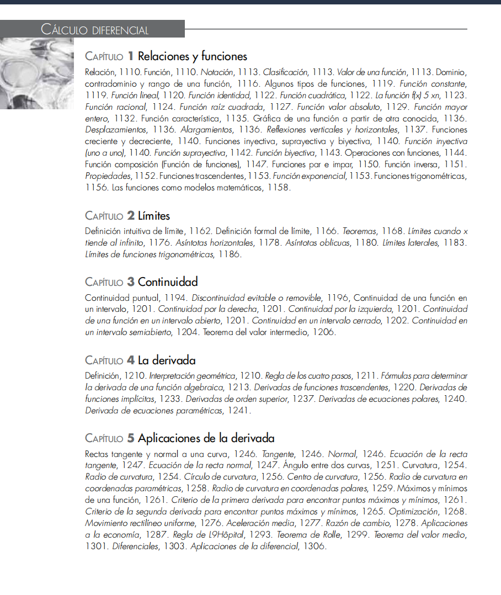
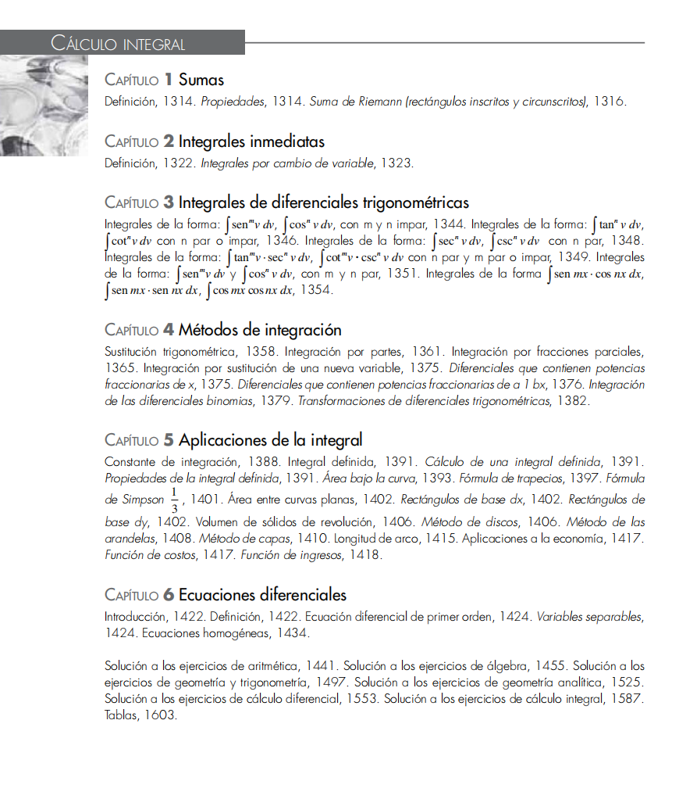
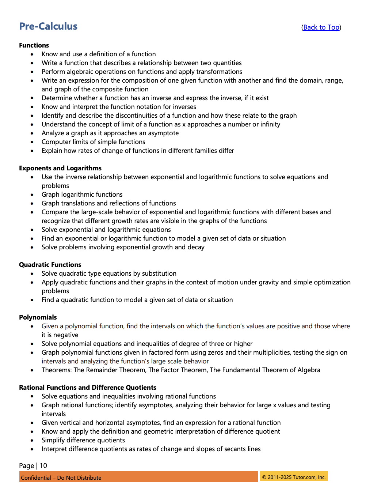
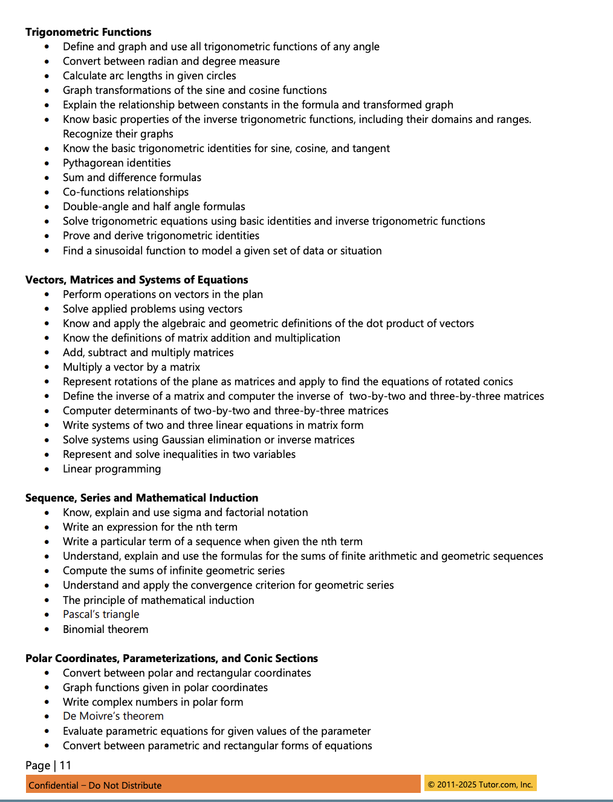
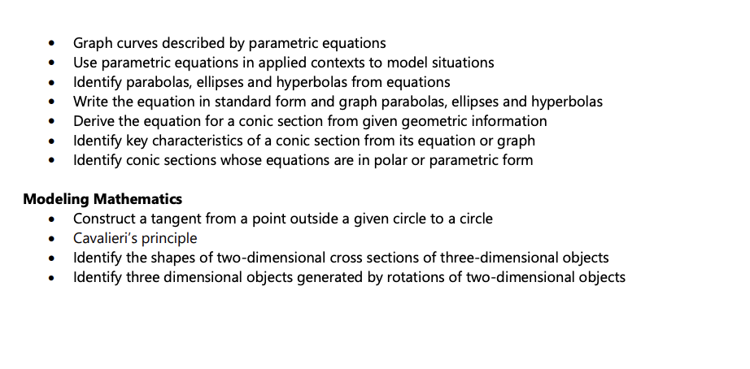
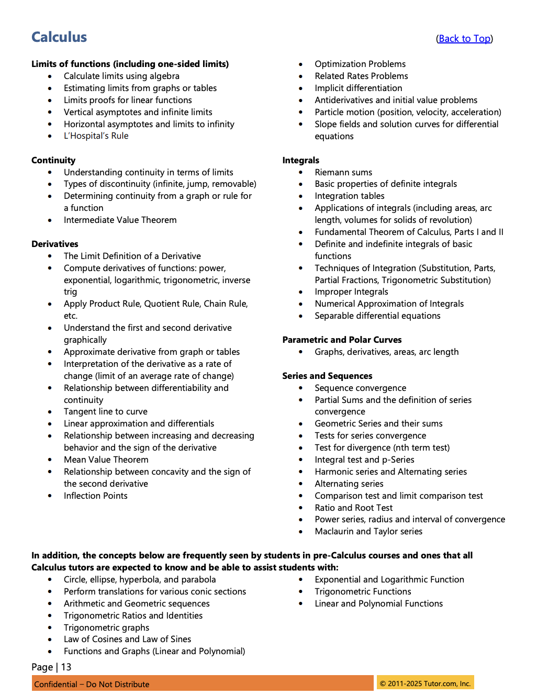
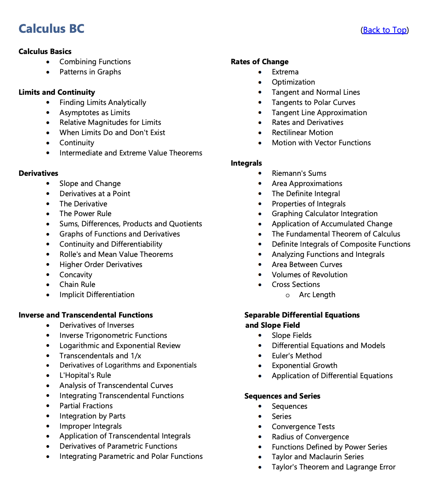

# CONTEXTO DEL PROYECTO - EDIPROF

## 1. FLUJO DE TRABAJO EN 3 ETAPAS

Me estás ayudando a generar contenido educativo para mi página web. El proceso se divide en **3 etapas secuenciales**:

### ETAPA 1: PLANEADOR DOCENTE 📋

**Objetivo:** Estructurar el árbol de carpetas y archivos para un CAPÍTULO completo.

**Qué hacer:**
1. Recibir el nombre del capítulo y contexto
2. Proponer el árbol de carpetas con temas y lecciones (.md)
3. Para cada lección, indicar brevemente qué conceptos cubrirá
4. Presentar el árbol para APROBACIÓN del usuario

**Formato de entrega:**
```
CAPÍTULO: [Nombre]
├── 01-tema-nombre/
│   ├── _meta.json
│   ├── 01-leccion-nombre.md → [conceptos que cubre]
│   └── 02-leccion-nombre.md → [conceptos que cubre]
```

**⚠️ NO generar contenido hasta que el árbol sea APROBADO.**

### ETAPA 2: GENERADOR DE LECCIONES 📝

**Objetivo:** Generar MASIVAMENTE todas las lecciones del árbol aprobado.

**Qué hacer:**
1. Tomar el árbol aprobado de la Etapa 1
2. Generar TODAS las lecciones siguiendo la filosofía pedagógica (Sección 3)
3. Crear los archivos `_meta.json` para cada tema
4. Cada lección = LIBRETO completo que el mejor profesor seguiría

**Reglas:**
- Una lección por archivo .md
- Estructura: Intro motivadora → Conceptos con ejemplos → Práctica
- SIN gráficos complejos (se agregan en Etapa 3)
- Tablas y LaTeX SÍ permitidos

### ETAPA 3: DISEÑADOR Y EVALUADOR PEDAGÓGICO 🎨

**Objetivo:** Enriquecer con gráficos y evaluar mejoras pedagógicas.

**Qué hacer:**
1. Revisar cada lección de la Etapa 2
2. **AGREGAR GRÁFICOS** donde sean útiles:
   - ⚠️ **REGLA OBLIGATORIA: MÍNIMO UNA ILUSTRACIÓN POR CONCEPTO**
   - Un "concepto" se define como cada sección que inicia con un título de Markdown (##, ###, etc.)
   - **EXCEPCIÓN:** La sección de "Ejercicios de Práctica" al final NO requiere ilustraciones
   - Elegir librería apropiada (JSXGraph, ECharts, Rough.js, Chart.js)
   - Seguir `.agent/workflows/graphics-context.md`
   - Gráficos claros como dibujos de pizarra
3. **EVALUAR PEDAGÓGICAMENTE:**
   - ¿Introducción motivadora?
   - ¿Ejemplos suficientes y claros?
   - ¿Transiciones suaves entre conceptos?
   - ¿El mejor profesor lo seguiría como libreto?
4. **PROPONER MEJORAS** si detecta oportunidades

**Criterios:**
| Aspecto | Pregunta clave |
|---------|----------------|
| Claridad | ¿Se entiende a la primera? |
| Progresión | ¿Simple → complejo? |
| Ejemplos | ¿Suficientes y paso a paso? |
| Visuales | ¿Hay mínimo 1 ilustración por concepto? |
| Motivación | ¿El estudiante sabe POR QUÉ? |

---

## 2. Estructura del Proyecto

```
src/content/
├── matematicas/           ← MATERIA
│   ├── 01-aritmetica/     ← CAPÍTULO
│   │   ├── 01-tema/       ← TEMA
│   │   │   ├── 01-leccion.md  ← LECCIÓN
│   │   │   └── 02-leccion.md
```

**Jerarquía:** MATERIA → CAPÍTULO → TEMA → LECCIÓN

---

## 3. FILOSOFÍA PEDAGÓGICA (CRÍTICO)

### 3.1 El Profesor Modelo

Cada lección debe ser UN LIBRETO LITERAL que el mejor profesor del colegio pueda seguir AL PIE DE LA LETRA. Este profesor se caracteriza por:

- **SIMPLICIDAD:** Explica conceptos complejos de forma brutalmente simple
- **CLARIDAD:** Cada oración tiene un solo propósito, sin ambigüedades
- **ORDEN:** Secuencia lógica y natural de ideas
- **MOTIVADOR:** Engancha al estudiante con preguntas y contexto real
- **INDUCTIVO:** Va de lo particular a lo general, de ejemplos a teoría
- **PROGRESIVO:** Una idea a la vez, sin saltos

### 3.1.1 Filosofía Anti-Abrumamiento

**PRINCIPIO:** El estudiante no debe ver mucho texto antes de entender visualmente qué va a aprender.

**REGLAS:**
1. **Cheat Sheet + Ilustración JUNTOS al inicio:** Tabla resumen + gráfico visual = combo ganador
2. **Motivación rápida en 10 segundos:** El estudiante debe ver inmediatamente QUÉ va a obtener
3. **Síntesis antes de detalle:** Primero el resumen visual, luego la explicación
4. **NUNCA cheat sheet solo sin ilustración:** La tabla sin el gráfico NO tiene sentido

**PATRÓN CORRECTO PARA LECCIONES CON MUCHOS CONCEPTOS:**
```
1️⃣ Título + 1 línea intro  
2️⃣ Tabla resumen (Cheat Sheet)  
3️⃣ Ilustración visual JUSTO DESPUÉS  
4️⃣ Tip/regla para recordar  
5️⃣ --- (separador)
6️⃣ Detalles de cada concepto
```

**EJEMPLO:**
- ❌ MALO: Tabla resumen → 200 líneas de texto → ilustración al final
- ✅ BUENO: Tabla resumen → ILUSTRACIÓN inmediata → Tip → detalles

### 3.2 Estructura de Cada Lección

```
1. INTRODUCCIÓN MOTIVADORA
   - Pregunta enganchadora ("¿Alguna vez te has preguntado...?")
   - Conexión con la vida real
   - ¿Qué vas a aprender? (lista clara)
   - El resumen de resultados.

2. CONCEPTO 1
   - Definición simple
   - Ejemplo 1 (resuelto paso a paso)
   - Ejemplo 2 (resuelto paso a paso)
   - [Ilustración]

3. CONCEPTO 2
   - Definición simple
   - Ejemplo 1
   - Ejemplo 2
   - [Ilustración]

4. [REPETIR para cada concepto] y tener en cuenta que un concepto es lo que empieza por un título de markdown en la lección, excepto lo que al final ya son los ejercicios de práctica.

5. RESUMEN (opcional pero recomendado)
   - Tabla o lista con los puntos clave

6. EJERCICIOS DE PRÁCTICA
   - 2 ejercicios por concepto
   - Con soluciones en <details>
```

### 3.3 Reglas de Redacción

| ✅ HACER | ❌ EVITAR |
|----------|-----------|
| Oraciones cortas y directas | Párrafos densos sin pausas |
| Una idea por párrafo | Múltiples conceptos mezclados |
| Verbos en segunda persona ("vas a aprender") | Lenguaje impersonal |
| Ejemplos antes que teoría abstracta | Definiciones sin contexto |
| Preguntas retóricas para enganchar | Entrar directo en fórmulas |
| Transiciones claras ("Ahora que sabes X, veamos Y") | Saltar entre temas |

---

## 4. FORMATO TÉCNICO

### 4.1 LaTeX

```markdown
# Bloque (centrado):
$$
x = \frac{-b \pm \sqrt{b^2 - 4ac}}{2a}
$$

# Inline:
La fórmula es $a^2 + b^2 = c^2$

# En tablas:
| Operación | Fórmula |
|-----------|---------|
| Área del círculo | $A = \pi r^2$ |
```

**⚠️ IMPORTANTE:**
- NO usar LaTeX en títulos de secciones (se renderiza mal)
- NO usar `\[...\]` ni `\(...\)` para ecuaciones

### 4.2 Emojis en Secciones

Usar emojis consistentes para organización visual:
- 📖 Definiciones
- 📊 Ejemplos/Gráficos
- 💡 Tips/Notas importantes
- ⚙️ Ejemplos detallados
- 📝 Ejercicios
- 🎯 Objetivos

NO usar emojis sobre el título 1 con el que empieza la lección, ya que esto trae problemas en el renderizado con el estilo que espero en las lecciones.

No usar código latex sobre los títulos de las secciones, ya que esto hace que la tabla de contenidos de la sección se vea como código crudo de latex. Usar recursivamente otras opciones.

---

## 5. ESTILO VISUAL (MODO CLARO/OSCURO)

**REGLA GENERAL:** Todo elemento visual debe verse bien en AMBOS modos.

### 5.1 ✅ USAR (funcionan en ambos modos)

1. **Markdown nativo:** Blockquotes (`>`), tablas, listas, LaTeX, enlaces
2. **Canvas con Rough.js/JSXGraph/ECharts:** Controlan sus propios colores
3. **Tarjetas con fondos OSCUROS:**
   ```html
   <div style="background: #1e293b; border-radius: 12px; padding: 1rem;">
     <div style="color: #f8fafc; font-weight: bold;">Título</div>
     <div style="color: #94a3b8;">Contenido</div>
   </div>
   ```
4. **Tarjetas con colores SATURADOS de alto contraste:**
   - Amarillo: `background: #fef3c7` + `color: #1e293b`
   - Azul: `background: #dbeafe` + `color: #1e3a8a`
   - Verde oscuro: `background: #064e3b` + `color: #ffffff`

### 5.2 ❌ EVITAR

1. Fondos claros (`#f0fdf4`) + texto gris (`#166534`) → invisible en modo oscuro
2. Colores de texto sin especificar → dependen del tema
3. `border-left` con fondo claro sin color de texto explícito

### 5.3 Gráficos (Wrapper estándar)

```html
<div style="background: #e2e8f0; border: 1px solid #cbd5e1; border-radius: 12px; padding: 1rem;">
  <span>📊</span>
  <div id="mi-grafico" style="..."></div>
</div>
```

---

## 6. EJEMPLOS DE REFERENCIA

Para ver el estilo correcto de lecciones, revisar:
- src/content/matematicas/01-aritmetica/05-proporcionalidad/03-regla-de-tres-simple.md
- http://localhost:4321/fisica/cinematica/mrua/lanzamiento-vertical
- http://localhost:4321/fisica/introduccion-a-la-fisica/introduccion/la-fisica-y-sus-ramas

---

## 7. CHECKLIST ANTES DE ENTREGAR

- [ ] ¿Tiene introducción motivadora con pregunta enganchadora?
- [ ] ¿Cada concepto tiene al menos 2 ejemplos resueltos?
- [ ] ¿Las ideas van de lo simple a lo complejo?
- [ ] ¿Hay transiciones claras entre conceptos?
- [ ] ¿Los títulos NO tienen LaTeX?
- [ ] ¿Las tarjetas HTML funcionan en modo oscuro?
- [ ] ¿Hay ejercicios de práctica al final?
- [ ] ¿Las ilustraciones son claras como un dibujo de pizarra?

---

## SOLICITUD CONCRETA

QUIERO QUE POR FAVOR HAGAS EL PAPEL DE PLANEADOR PEDAGÓGICO DE AMERICA LATINA, PARTICULARMENTE COLOMBIA, PARA QUE ORDENES ESTOS TEMAS D EUNA FORMA LÓGICA, SECUENCIAL, NATURALMENTE PROGRESIVA, INTUITIVA...CON TODAS LAS INDICACIONES QUE TE DOY ARRIBA. QUE ESTO SEA DIGNO DE ADMIRACIÓN PEDAGÓGICA EN SU DISEÑO DE ARBOL DE CARPETAS Y TODO EL CAPÍTULO, POR SU EXQUISITO NIVEL PEDAGÓGICO. PUEDES VER CÓMO ESTÁ ESTRUCTURADO POR EJEMPLO EL CAPÍUTLO DE ESTADÍSTICA DESCRIPTIVA O ESTADÍSTICA DESCRIPTIVA, Y ASIMISMO SIGUIENDO ESA LÓGICA VAS A PRESENTAR EL ÁRBOL DE CARPETA SUGERIDO PARA EL CAPÍTULO DE ESTADÍSTICA.

ESTA ES LA ESTRUCTURA QUE PROPONE UNVLIBRO QUE TENGO DE REFERENCIA, PERO POR FAVOR, TÚ TÓMALO SOLO COMO ESO, Y EN REALIDAD ANALIZA DE LA MEJOR MANERA POSIBLE CÓMO INTRODUCIR ESTE TEMA COMO QUIERO, Y QUE LUEGO MÁS ADELANTE SE DÉ LA POSIBILIDAD, O NO SÉ CÓMO, TÚ ERES EL EXPERTO Y ME DIRÁS, DE DISEÑAR ESTO...O SI MEJOR DECIR PRIMERO ESTADÍSITICA DESCRIPTIVA Y LUEGO ESTADÍSITCA INFERENCIA...NO SÉ, TÚ ME DIRÁS.


TENGO UN LIBRIO GÚIA, PERO TÚ HARÁS UNA TAREA MUCHO MÁS PROFUNDA Y HARÁS UNA PROPUESTA PARA EL CAPÍTULO DE CALCULO DIFERENCIAL Y OTRA PARA EL CAPÍTULO DE CÁLCULO INTEGRAL.

ESTE ES EL CONTENIDO DEL LIBRO QUE TENGO DE GUÍA:

### CÁLCULO DIFERENCIAL:



### **Capítulo 1: Relaciones y funciones**
Este capítulo establece el lenguaje fundamental del cálculo. Su intención es que el estudiante distinga claramente entre una relación y una función, y aprenda a manipularlas algebraicamente y gráficamente antes de aplicarles límites o derivadas.
*   **Conceptos básicos:** Definiciones de relación y función, notación funcional ($f(x)$), y clasificación de funciones.
*   **Propiedades:** Cálculo de dominio, contradominio y rango. Evaluación del valor de una función.
*   **Tipos de funciones:** Estudio detallado de funciones constantes, lineales, identidad, cuadráticas, racionales, raíz cuadrada, valor absoluto, mayor entero y características.
*   **Transformaciones gráficas:** Cómo graficar funciones a partir de otras conocidas mediante desplazamientos, alargamientos y reflexiones.
*   **Clasificación avanzada:** Funciones inyectivas (uno a uno), suprayectivas y biyectivas. Funciones pares e impares.
*   **Operaciones:** Suma, resta, multiplicación y división de funciones. Función composición ($f \circ g$) y función inversa.
*   **Funciones trascendentes:** Introducción a funciones exponenciales y trigonométricas como modelos matemáticos.

### **Capítulo 2: Límites**
Aquí se introduce el concepto central que diferencia al cálculo del álgebra: el paso al límite. Se busca formalizar la noción de aproximación.
*   **Definiciones:** Definición intuitiva y defi­nición formal ($\epsilon - \delta$) de límite.
*   **Cálculo de límites:** Teoremas sobre límites y cómo evaluar límites de funciones algebraicas y trigonométricas.
*   **Comportamiento asintótico:** Límites cuando $x$ tiende al infinito, asíntotas horizontales y oblicuas.
*   **Límites laterales:** Análisis del comportamiento de la función por la izquierda y por la derecha.

### **Capítulo 3: Continuidad**
Este capítulo conecta el concepto de límite con la "suavidad" o integridad de una curva. Es el pre-requisito teórico para poder derivar.
*   **Tipos de continuidad:** Continuidad puntual y continuidad en un intervalo (abierto, cerrado y semiabierto).
*   **Discontinuidades:** Identificación de puntos de ruptura y el concepto de discontinuidad evitable o removible.
*   **Teoremas:** Teorema del valor intermedio.

### **Capítulo 4: La derivada**
Es el núcleo operativo de la sección. El objetivo es que el estudiante domine la técnica de derivación para cualquier tipo de función.
*   **Definición:** Interpretación geométrica de la derivada (pendiente de la recta tangente) y la "Regla de los cuatro pasos" (derivación por definición).
*   **Fórmulas de derivación:** Reglas para derivar funciones algebraicas y trascendentes (trigonométricas, logarítmicas, exponenciales).
*   **Técnicas avanzadas:** Derivada de funciones implícitas y derivadas de orden superior (segunda derivada, tercera, etc.).
*   **Otros sistemas:** Derivadas de ecuaciones en coordenadas polares y ecuaciones paramétricas.

### **Capítulo 5: Aplicaciones de la derivada**
Aquí se explota la derivada como herramienta para resolver problemas geométricos, físicos y de optimización.
*   **Geometría:** Ecuaciones de la recta tangente y normal a una curva. Cálculo del ángulo entre dos curvas. Curvatura y radio de curvatura.
*   **Análisis de funciones:** Criterios de la primera y segunda derivada para encontrar máximos y mínimos de una función (puntos críticos).
*   **Optimización:** Resolución de problemas prácticos para maximizar o minimizar recursos (áreas, volúmenes, costos).
*   **Física (Cinemática):** Aplicaciones al movimiento rectilíneo uniforme, cálculo de velocidad y aceleración media.
*   **Razón de cambio:** Problemas de razones de cambio relacionadas.
*   **Economía:** Aplicaciones específicas de la derivada en contextos económicos.
*   **Teoremas avanzados y cálculo aproximado:** Regla de L'Hôpital (para límites indeterminados), Teorema de Rolle, Teorema del valor medio y el uso de diferenciales para estimaciones.


### CÁLCULO INTEGRAL: 

### **Capítulo 1: Sumas**
Este capítulo sirve como fundamento conceptual. Antes de enseñar las reglas de integración, el texto busca que el estudiante entienda la integral como un límite de sumas.
*   **Conceptos clave:** Definición y propiedades de la notación sigma (sumatoria).
*   **Aproximación de áreas:** Estudio de las **Sumas de Riemann**, utilizando rectángulos inscritos y circunscritos para aproximar el área bajo una curva,.

### **Capítulo 2: Integrales inmediatas**
Aquí se formaliza la operación inversa a la derivada. El objetivo es que el estudiante aprenda a manipular algebraicamente las funciones para que encajen en las fórmulas básicas de integración.
*   **Definición:** Concepto de integral indefinida.
*   **Técnica fundamental:** Integrales que se resuelven por **cambio de variable** directo (sustitución simple) para llevarlas a una forma inmediata.

### **Capítulo 3: Integrales de diferenciales trigonométricas**
Este es un capítulo técnico dedicado exclusivamente a la manipulación de potencias de funciones trigonométricas. Es el preámbulo necesario para dominar métodos más avanzados (como la sustitución trigonométrica del siguiente capítulo).
*   **Casos de estudio:**
    *   Integrales de la forma $\sin^m v \cdot \cos^n v$ (cuando $m$ y $n$ son pares o impares).
    *   Integrales con potencias de $\tan^n v$, $\cot^n v$.
    *   Integrales con potencias de $\sec^n v$, $\csc^n v$ (casos pares).
    *   Combinaciones de tangentes con secantes y cotangentes con cosecantes.
    *   Integrales de productos especiales como $\sin(mx) \cdot \cos(nx)$, $\sin(mx) \cdot \sin(nx)$, etc.,.

### **Capítulo 4: Métodos de integración**
Este es el núcleo "fuerte" del curso. Aquí se presentan las herramientas para resolver integrales que no son directas ni trigonométricas simples. La intención es desarrollar el pensamiento analítico para elegir la estrategia adecuada.
*   **Sustitución trigonométrica:** Uso de triángulos rectángulos para eliminar raíces cuadradas de la forma $\sqrt{a^2 \pm u^2}$.
*   **Integración por partes:** Técnica para integrar productos de funciones (fórmula $\int u dv$).
*   **Fracciones parciales:** Descomposición de funciones racionales para integrar cocientes de polinomios.
*   **Sustitución diversa:** Integración por sustitución de una nueva variable (cambios especiales para racionalizar integrales).
*   **Diferenciales binomias:** Integración de expresiones de la forma $x^m (a + bx^n)^p$.
*   **Transformaciones:** Uso de identidades para simplificar diferenciales trigonométricas complejas.

### **Capítulo 5: Aplicaciones de la integral**
Una vez dominada la técnica, este capítulo se enfoca en el "para qué" sirve la integral, conectando las matemáticas con la geometría y la economía.
*   **Conceptos fundamentales:** Significado de la constante de integración e introducción a la **integral definida**.
*   **Áreas:** Cálculo del área bajo la curva y área entre dos curvas planas (utilizando rectángulos verticales $dx$ u horizontales $dy$).
*   **Métodos numéricos:** Cálculo aproximado de integrales definidas mediante la **Fórmula de trapecios** y la **Fórmula de Simpson 1/3**.
*   **Volúmenes:** Cálculo de volúmenes de sólidos de revolución mediante el método de discos, método de las arandelas y método de capas (cascarones).
*   **Otras aplicaciones:** Cálculo de la longitud de arco. Aplicaciones a la economía (funciones de costos e ingresos),.

### **Capítulo 6: Ecuaciones diferenciales**
Este capítulo final sirve como una introducción o puente hacia cursos superiores de matemáticas, mostrando cómo la integral resuelve igualdades que involucran derivadas.
*   **Fundamentos:** Introducción y definición de una ecuación diferencial.
*   **Métodos de solución:** Resolución de ecuaciones diferenciales de primer orden mediante **variables separables** y resolución de ecuaciones **homogéneas**.


ADEMÁS, TE PASO INFORMACIÓN SOBRE LOS TEMAS DE CÁLCULO QUE SE VEN EN UNA PLATAFORMA DE TUTOR.COM, PARA QUE LO TENGAS EN CUENTA YA QUE EN COLOMBIA RECUERDO QUE LA PARTE DE SUMATORIAS Y SERIES LA METEN EN CÁLCULO INTEGRAL, ASÍ COMO LO DE PARAMÉTRICAS Y POLARES...SI MAL NO RECUERDO. AHÍ TE VA EL PLAN DE TUTOR.COM








CON TODO ESTO EN METE, YO LO PREVISUALIZO END DOS CAPÍTULOS (CÁLCULO DIFERENCIAL Y CÁLCULO INTEGRAL), PERO TÚ PUEDES EVALUAR SI CABE UN TERCER CAPÍTULO MÁS, POR EJEMPLO, LLAMADADO PRECÁLCULO (ANTES DE CÁLCULO DE DIFERENCIAL), EN EL CUAL PODRÍAN VERSE, POR EJEMPLO LOS SIGUIENTES CONCEPTOS: DESIGUALDADES Y VALOR ABSOLUTO, INECUACIONES LINEALES, INECUACIONES CUADRÁTICAS, INECUACIONES RACIONALES, VALOR ABSOLUTO, PROPIEDADES, FUNCIONES REALES....


PROCEDE CON LA PROPUESTA DE ÁRBOL DE CARPETAS.