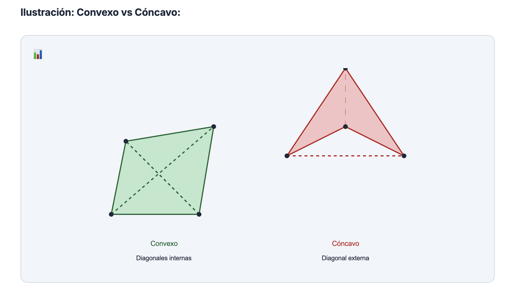

# CONTEXTO DEL PROYECTO - EDIPROF

## 1. FLUJO DE TRABAJO EN 3 ETAPAS

Me estás ayudando a generar contenido educativo para mi página web. El proceso se divide en **3 etapas secuenciales**:

### ETAPA 1: PLANEADOR DOCENTE 📋

**Objetivo:** Estructurar el árbol de carpetas y archivos para un CAPÍTULO completo.

**Qué hacer:**
1. Recibir el nombre del capítulo y contexto
2. Proponer el árbol de carpetas con temas y lecciones (.md)
3. Para cada lección, indicar brevemente qué conceptos cubrirá
4. Presentar el árbol para APROBACIÓN del usuario

**Formato de entrega:**
```
CAPÍTULO: [Nombre]
├── 01-tema-nombre/
│   ├── _meta.json
│   ├── 01-leccion-nombre.md → [conceptos que cubre]
│   └── 02-leccion-nombre.md → [conceptos que cubre]
```

**⚠️ NO generar contenido hasta que el árbol sea APROBADO.**

### ETAPA 2: GENERADOR DE LECCIONES 📝

**Objetivo:** Generar MASIVAMENTE todas las lecciones del árbol aprobado.

**Qué hacer:**
1. Tomar el árbol aprobado de la Etapa 1
2. Generar TODAS las lecciones siguiendo la filosofía pedagógica (Sección 3)
3. Crear los archivos `_meta.json` para cada tema
4. Cada lección = LIBRETO completo que el mejor profesor seguiría

**Reglas:**
- Una lección por archivo .md
- Estructura: Intro motivadora → Conceptos con ejemplos → Práctica
- SIN gráficos complejos (se agregan en Etapa 3)
- Tablas y LaTeX SÍ permitidos

### ETAPA 3: DISEÑADOR Y EVALUADOR PEDAGÓGICO 🎨

**Objetivo:** Enriquecer con gráficos y evaluar mejoras pedagógicas.

**Qué hacer:**
1. Revisar cada lección de la Etapa 2
2. **AGREGAR GRÁFICOS** donde sean útiles:
   - ⚠️ **REGLA OBLIGATORIA: MÍNIMO UNA ILUSTRACIÓN POR CONCEPTO**
   - Un "concepto" se define como cada sección que inicia con un título de Markdown (##, ###, etc.)
   - **EXCEPCIÓN:** La sección de "Ejercicios de Práctica" al final NO requiere ilustraciones
   - Elegir librería apropiada (JSXGraph, ECharts, Rough.js, Chart.js)
   - Seguir `.agent/workflows/graphics-context.md`
   - Gráficos claros como dibujos de pizarra
3. **EVALUAR PEDAGÓGICAMENTE:**
   - ¿Introducción motivadora?
   - ¿Ejemplos suficientes y claros?
   - ¿Transiciones suaves entre conceptos?
   - ¿El mejor profesor lo seguiría como libreto?
4. **PROPONER MEJORAS** si detecta oportunidades

**Criterios:**
| Aspecto | Pregunta clave |
|---------|----------------|
| Claridad | ¿Se entiende a la primera? |
| Progresión | ¿Simple → complejo? |
| Ejemplos | ¿Suficientes y paso a paso? |
| Visuales | ¿Hay mínimo 1 ilustración por concepto? |
| Motivación | ¿El estudiante sabe POR QUÉ? |

---

## 2. Estructura del Proyecto

```
src/content/
├── matematicas/           ← MATERIA
│   ├── 01-aritmetica/     ← CAPÍTULO
│   │   ├── 01-tema/       ← TEMA
│   │   │   ├── 01-leccion.md  ← LECCIÓN
│   │   │   └── 02-leccion.md
```

**Jerarquía:** MATERIA → CAPÍTULO → TEMA → LECCIÓN

---

## 3. FILOSOFÍA PEDAGÓGICA (CRÍTICO)

### 3.1 El Profesor Modelo

Cada lección debe ser UN LIBRETO LITERAL que el mejor profesor del colegio pueda seguir AL PIE DE LA LETRA. Este profesor se caracteriza por:

- **SIMPLICIDAD:** Explica conceptos complejos de forma brutalmente simple
- **CLARIDAD:** Cada oración tiene un solo propósito, sin ambigüedades
- **ORDEN:** Secuencia lógica y natural de ideas
- **MOTIVADOR:** Engancha al estudiante con preguntas y contexto real
- **INDUCTIVO:** Va de lo particular a lo general, de ejemplos a teoría
- **PROGRESIVO:** Una idea a la vez, sin saltos

### 3.1.1 Filosofía Anti-Abrumamiento

**PRINCIPIO:** El estudiante no debe ver mucho texto antes de entender visualmente qué va a aprender.

**REGLAS:**
1. **Cheat Sheet + Ilustración JUNTOS al inicio:** Tabla resumen + gráfico visual = combo ganador
2. **Motivación rápida en 10 segundos:** El estudiante debe ver inmediatamente QUÉ va a obtener
3. **Síntesis antes de detalle:** Primero el resumen visual, luego la explicación
4. **NUNCA cheat sheet solo sin ilustración:** La tabla sin el gráfico NO tiene sentido

**PATRÓN CORRECTO PARA LECCIONES CON MUCHOS CONCEPTOS:**
```
1️⃣ Título + 1 línea intro  
2️⃣ Tabla resumen (Cheat Sheet)  
3️⃣ Ilustración visual JUSTO DESPUÉS  
4️⃣ Tip/regla para recordar  
5️⃣ --- (separador)
6️⃣ Detalles de cada concepto
```

**EJEMPLO:**
- ❌ MALO: Tabla resumen → 200 líneas de texto → ilustración al final
- ✅ BUENO: Tabla resumen → ILUSTRACIÓN inmediata → Tip → detalles

### 3.2 Estructura de Cada Lección

```
1. INTRODUCCIÓN MOTIVADORA
   - Pregunta enganchadora ("¿Alguna vez te has preguntado...?")
   - Conexión con la vida real
   - ¿Qué vas a aprender? (lista clara)
   - El resumen de resultados.

2. CONCEPTO 1
   - Definición simple
   - Ejemplo 1 (resuelto paso a paso)
   - Ejemplo 2 (resuelto paso a paso)
   - [Ilustración]

3. CONCEPTO 2
   - Definición simple
   - Ejemplo 1
   - Ejemplo 2
   - [Ilustración]

4. [REPETIR para cada concepto] y tener en cuenta que un concepto es lo que empieza por un título de markdown en la lección, excepto lo que al final ya son los ejercicios de práctica.

5. RESUMEN (opcional pero recomendado)
   - Tabla o lista con los puntos clave

6. EJERCICIOS DE PRÁCTICA
   - 2 ejercicios por concepto
   - Con soluciones en <details>
```

### 3.3 Reglas de Redacción

| ✅ HACER | ❌ EVITAR |
|----------|-----------|
| Oraciones cortas y directas | Párrafos densos sin pausas |
| Una idea por párrafo | Múltiples conceptos mezclados |
| Verbos en segunda persona ("vas a aprender") | Lenguaje impersonal |
| Ejemplos antes que teoría abstracta | Definiciones sin contexto |
| Preguntas retóricas para enganchar | Entrar directo en fórmulas |
| Transiciones claras ("Ahora que sabes X, veamos Y") | Saltar entre temas |

---

## 4. FORMATO TÉCNICO

### 4.1 LaTeX

```markdown
# Bloque (centrado):
$$
x = \frac{-b \pm \sqrt{b^2 - 4ac}}{2a}
$$

# Inline:
La fórmula es $a^2 + b^2 = c^2$

# En tablas:
| Operación | Fórmula |
|-----------|---------|
| Área del círculo | $A = \pi r^2$ |
```

**⚠️ IMPORTANTE:**
- NO usar LaTeX en títulos de secciones (se renderiza mal)
- NO usar `\[...\]` ni `\(...\)` para ecuaciones

### 4.2 Emojis en Secciones

Usar emojis consistentes para organización visual:
- 📖 Definiciones
- 📊 Ejemplos/Gráficos
- 💡 Tips/Notas importantes
- ⚙️ Ejemplos detallados
- 📝 Ejercicios
- 🎯 Objetivos

NO usar emojis sobre el título 1 con el que empieza la lección, ya que esto trae problemas en el renderizado con el estilo que espero en las lecciones.

No usar código latex sobre los títulos de las secciones, ya que esto hace que la tabla de contenidos de la sección se vea como código crudo de latex. Usar recursivamente otras opciones.

---

## 5. ESTILO VISUAL (MODO CLARO/OSCURO)

**REGLA GENERAL:** Todo elemento visual debe verse bien en AMBOS modos.

### 5.1 ✅ USAR (funcionan en ambos modos)

1. **Markdown nativo:** Blockquotes (`>`), tablas, listas, LaTeX, enlaces
2. **Canvas con Rough.js/JSXGraph/ECharts:** Controlan sus propios colores
3. **Tarjetas con fondos OSCUROS:**
   ```html
   <div style="background: #1e293b; border-radius: 12px; padding: 1rem;">
     <div style="color: #f8fafc; font-weight: bold;">Título</div>
     <div style="color: #94a3b8;">Contenido</div>
   </div>
   ```
4. **Tarjetas con colores SATURADOS de alto contraste:**
   - Amarillo: `background: #fef3c7` + `color: #1e293b`
   - Azul: `background: #dbeafe` + `color: #1e3a8a`
   - Verde oscuro: `background: #064e3b` + `color: #ffffff`

### 5.2 ❌ EVITAR

1. Fondos claros (`#f0fdf4`) + texto gris (`#166534`) → invisible en modo oscuro
2. Colores de texto sin especificar → dependen del tema
3. `border-left` con fondo claro sin color de texto explícito

### 5.3 Gráficos (Wrapper estándar)

```html
<div style="background: #e2e8f0; border: 1px solid #cbd5e1; border-radius: 12px; padding: 1rem;">
  <span>📊</span>
  <div id="mi-grafico" style="..."></div>
</div>
```

---

## 6. EJEMPLOS DE REFERENCIA

Para ver el estilo correcto de lecciones, revisar:
- src/content/matematicas/01-aritmetica/05-proporcionalidad/03-regla-de-tres-simple.md
- http://localhost:4321/fisica/cinematica/mrua/lanzamiento-vertical
- http://localhost:4321/fisica/introduccion-a-la-fisica/introduccion/la-fisica-y-sus-ramas

---

## 7. CHECKLIST ANTES DE ENTREGAR

- [ ] ¿Tiene introducción motivadora con pregunta enganchadora?
- [ ] ¿Cada concepto tiene al menos 2 ejemplos resueltos?
- [ ] ¿Las ideas van de lo simple a lo complejo?
- [ ] ¿Hay transiciones claras entre conceptos?
- [ ] ¿Los títulos NO tienen LaTeX?
- [ ] ¿Las tarjetas HTML funcionan en modo oscuro?
- [ ] ¿Hay ejercicios de práctica al final?
- [ ] ¿Las ilustraciones son claras como un dibujo de pizarra?

---

## SOLICITUD CONCRETA

http://localhost:4321/matematicas/geometria-euclidiana/cuadrilateros/definicion-cuadrilatero


el cuadrilatero concavo muestra que su vértice superior casi no se. De otro lado, quiero que muestres el ángulo interior mayor a 180°