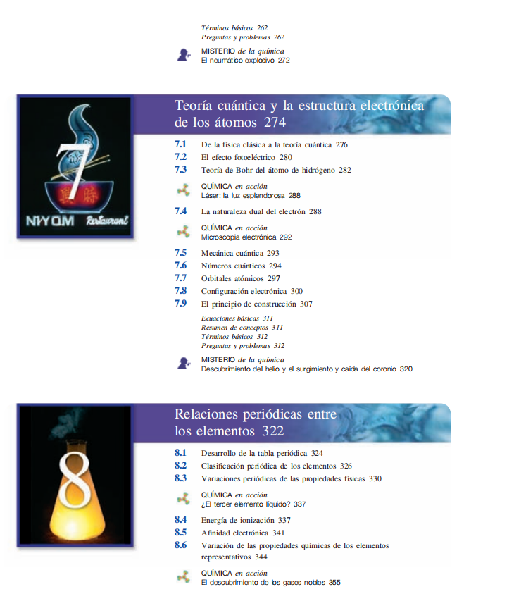

# CONTEXTO DEL PROYECTO

## Contexto general

### Tu rol
Me estás ayudando a generar las lecciones de clase que son archivos .md que se renderizan en mi página web. o puedes bien, tomar el rol de planeador docente para ayudarme a estructurar el árbol de carpetas y archivos .md que se van a generar. Así las cosas, tu rol puede ser dependiendo lo que te solicite, de generador de contenidos (lecciones .md), o de planeador docente (árbol de carpetas y archivos .md). O puedes también, una vez ya estén planeadas, generadas y aprobadas las lecciones, ayudarme con el componente gráfico, el cual se maneja a través de las librerías ECHARTS y JSXGRAPHS, ya instaladas, y para lo cual te vas a guiar lo que dice en .agent/workflows/graphics-context.md

Para la generación de gráficos por favor usar un Wrapper visual con las siguientes caracterísiticas: 
- 📊 Icono solo (sin texto)
- Fondo gris neutro #e2e8f0
- Borde sutil #cbd5e1
- Bordes redondeados 12px

Es importante también que si corresponde, le agregues título a los ejes de los gráficos.

### Estamos en fase de cliente docente
Ten en cuenta que ahora mismo estamos en plan no de programador del sitio sino de cliente docente que se encarga de generar los contenidos para la página web. Estos contenidos son cargados dentro de la carpeta src/content/.

### Estructura de carpetas y archivos
La carpeta src/content/ tiene unas materias, las cuales son matemáticas, física, química y ciencias. Cada materia tiene capítulos, cada capítulo tiene temas, y cada tema tiene lecciones. De modo que la división de carpetas y archivos sigue esta estructura, haciendo la claridad que cada archivo .md corresponde a una lección.

### Para la generación de las lecciones

#### Estilo de las lecciones

Fíjate por ejemplo en el estilo que manejan mis lecciones en la carpeta src/content/matematicas/01-aritmetica/05-proporcionalidad/03-regla-de-tres-simple.md, es decir, con un estilo sencillo, fácilmente entendible, progresivo, que trabaja una idea por vez, y la pone en práctica con ejemplos, y luego ahí sí trabaja con otra idea o subsección dentro de la misma lección.

#### Expresiones con latex
Ten en cuenta que estoy usando kathex para renderizar los archivos .md, por lo que las ecuaciones en bloque son del tipo

$$

$$

Las ecuaciones inline son del tipo $, al igual que las ecuaciones en tabla.

Esto es importante para que las ecuaciones se rendericen correctamente. No usar expresiones del tipo [] o () para las ecuaciones. Guíate de las expresiones que se usan en los archivos .md existentes, por ejemplo en la carpeta src/content/matematicas/01-aritmetica/02-teoria-de-numeros, o en la carpeta src/content/fisica/02-cinematica/02-escalares-y-vectores, por dar un ejemplo.

Por favor, en los títulos de cada sección de una lección, no les metas código de latex, ya que se renderiza mal (latex crudo), tanto en la tabla de contenidos como en la barra de navegación lateral. Así que por favor tenlo en cuenta.

#### Tener en cuenta

Para la elaboración de la lecciones, ten en cuenta que el una MATERIA > CAPITULO > TEMAS > LECCIÓN, y que en cada lección se abordan diferentes conceptos, los cuales quiero que los trabajes progresivamente, uno a uno, cosa que si empiezas uno, lo explicas por su definición o introducción, luego haces un par de ejemplos de ese concepto (o más si ves que es algo muy fácil, tipo identificar los elementos en una expresión algebraica), luego pasas al otro concepto dentro de esa lección, y luego haces un par de ejemplos de ese concepto, y luego pasas al siguiente concepto, y así sucesivamente. La idea es que al final cierres con una sección tipo, 2 ejercicios por concepto en una nueva sección de esa lección que se llame tipo "Ejercicios de práctica" o "Ejercicios para practicar", o el nombre que más adecuado encuentres.

## Solicitud concreta

quiero que los gráficos cont tengan los ejes pintados así, de 1 en 1, y loas etiquetas de los ejes horicontal y vertical, o sea los valores (1,2,3,4...) vayan en la mitad, no al extremo de la cuadrícula que representa el plano me entiendes?

confirmame si me entiendes la solciitud

