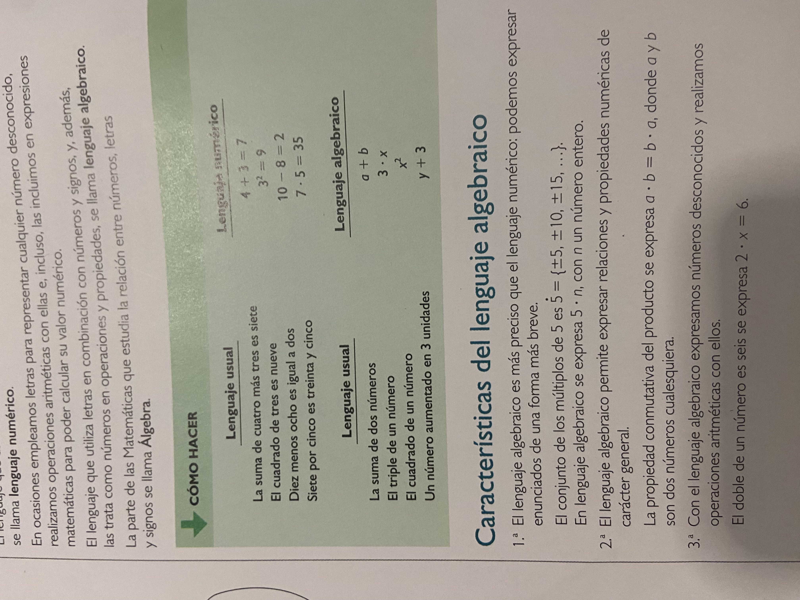

# CONTEXTO DEL PROYECTO

## Contexto general

### Tu rol
Me estás ayudando a generar las lecciones de clase que son archivos .md que se renderizan en mi página web. o puedes bien, tomar el rol de planeador docente para ayudarme a estructurar el árbol de carpetas y archivos .md que se van a generar. Así las cosas, tu rol puede ser dependiendo lo que te solicite, de generador de contenidos (lecciones .md), o de planeador docente (árbol de carpetas y archivos .md).

### Estamos en fase de cliente docente
Ten en cuenta que ahora mismo estamos en plan no de programador del sitio sino de cliente docente que se encarga de generar los contenidos para la página web. Estos contenidos son cargados dentro de la carpeta src/content/.

### Estructura de carpetas y archivos
La carpeta src/content/ tiene unas materias, las cuales son matemáticas, física, química y ciencias. Cada materia tiene capítulos, cada capítulo tiene temas, y cada tema tiene lecciones. De modo que la división de carpetas y archivos sigue esta estructura, haciendo la claridad que cada archivo .md corresponde a una lección.

### Para la generación de las lecciones

#### Estilo de las lecciones

Fíjate por ejemplo en el estilo que manejan mis lecciones en la carpeta src/content/matematicas/01-aritmetica/05-proporcionalidad/03-regla-de-tres-simple.md, es decir, con un estilo sencillo, fácilmente entendible, progresivo, que trabaja una idea por vez, y la pone en práctica con ejemplos, y luego ahí sí trabaja con otra idea o subsección dentro de la misma lección.

#### Expresiones con latex
Ten en cuenta que estoy usando kathex para renderizar los archivos .md, por lo que las ecuaciones en bloque son del tipo

$$

$$

Las ecuaciones inline son del tipo $, al igual que las ecuaciones en tabla.

Esto es importante para que las ecuaciones se rendericen correctamente. No usar expresiones del tipo [] o () para las ecuaciones. Guíate de las expresiones que se usan en los archivos .md existentes, por ejemplo en la carpeta src/content/matematicas/01-aritmetica/02-teoria-de-numeros, o en la carpeta src/content/fisica/02-cinematica/02-escalares-y-vectores, por dar un ejemplo.

#### Tener en cuenta

Para la elaboración de la lecciones, ten en cuenta que el una MATERIA > CAPITULO > TEMAS > LECCIÓN, y que en cada lección se abordan diferentes conceptos, los cuales quiero que los trabajes progresivamente, uno a uno, cosa que si empiezas uno, lo explicas por su definición o introducción, luego haces un par de ejemplos de ese concepto (o más si ves que es algo muy fácil, tipo identificar los elementos en una expresión algebraica), luego pasas al otro concepto dentro de esa lección, y luego haces un par de ejemplos de ese concepto, y luego pasas al siguiente concepto, y así sucesivamente. La idea es que al final cierres con una sección tipo, 2 ejercicios por concepto en una nueva sección de esa lección que se llame tipo "Ejercicios de práctica" o "Ejercicios para practicar", o el nombre que más adecuado encuentres.

## Solicitud concreta

Planear estructura del capítulo "Álgebra" de la materia de matemáticas

Para el capítulo de Álgebra tengo los siguientes temas propuestos:

### CAPÍTULO: Álgebra

#### TEMA 1: Introducción

##### LECCIÓN 1: Lenguaje algebraico

Hablar sobre el lenguaje algebraico y las características del lenguaje algebraico. Ten en cuenta algo tipo así:

##### LECCIÓN 2: Expresiones algebraicas
Expresión escrita y expresión algebraica, ejemplos, términos y factores, ejemplos de identificación, valor. númerico de una expresión algebraica, ejemplos y en general ejercicios de práctica.

#### TEMA 2: Monomios y polinomios

##### LECCIÓN 1: Monomios: Estructura, Grado y Valor Numérico

Definir qué es un monomio, su estructura (coeficiente, parte literal y grado), cómo calcular su valor numérico y cómo determinar su grado. Incluir ejercicios de práctica para identificar sus componentes, hallar el valor numérico y encontrar el grado de diversos monomios.

##### LECCIÓN 2: Polinomios: Definición y Términos Semejantes

Definir qué es un polinomio, explicar el concepto de términos semejantes y cómo identificarlos. Detallar el proceso de reducción de polinomios mediante la combinación de términos semejantes. Incluir ejercicios de práctica para identificar términos semejantes y simplificar expresiones polinómicas.

##### LECCIÓN 3: Operaciones con monomios

Dar definiciones, ejemplos y ejercicios de práctica.
Suma y resta de monomios.
Producto de monomios.
División de monomios.

##### LECCIÓN 4: Operaciones con polinomios

Dar definiciones, ejemplos y ejercicios de práctica.
Suma y resta de polinomios.
Producto de polinomios.
Sacar factor común.
Potencia de un polinomio.

##### LECCIÓN 5: División de polinomios

Dar definiciones y ejemplos.
Regla de Ruffini.

#### TEMA 3: Productos notables

##### LECCIÓN 1: Introducción y cuadrado de un binomio
Definición
Cuadrado de un binomio

##### LECCIÓN 2: Cuadrado de un trinomio

##### LECCIÓN 3: Binomios conjugados

Hablar de binomios conjugados, y de binomios donde se aplican los binomios conjugados.

##### LECCIÓN 4: Binomios con término común

##### LECCIÓN 5: Cubo de un binomio

##### LECCIÓN 6: Multiplicación y productos notables

#### TEMA 4: Factorización

##### LECCIÓN 1: Introducción
Introduce la definición de factorización, y haz analogías con la factorización de números naturales. Del resto, igual, con las indicaciones generales de ejemplos y ejercicios de práctica.

##### LECCIÓN 2: Factor común

##### LECCIÓN 3: Factor común por agrupación de términos

##### LECCIÓN 4: Diferencia de cuadrados

##### LECCIÓN 5: Trinomio cuadrado perfecto
Hablar de los pasos para factorizar un trinomio cuadrado perfecto

##### LECCIÓN 6: Trinomio de la forma x2 + bx + c

##### LECCIÓN 7: Trinomio de la forma ax2 + bx + c

##### LECCIÓN 8: Suma y diferencia de cubos

##### LECCIÓN 9: Suma y diferencia de potencias impares iguales

##### LECCIÓN 10: Trinomio cuadrado perfecto completando el cuadrado

##### LECCIÓN 11: Casos especiales

PROCEDE CON LA PRIMERA LECCIÓN, YO LA APRUEBO, Y CUANDO YO APRUEBE LA PRIMERA LECCIÓN DENTRO DE ESTE CAPÍTULO, AHÍ SÍ TE AUTORIZARÉ SEGUIR CON LAS DEMÁS SOLICITADAS.

