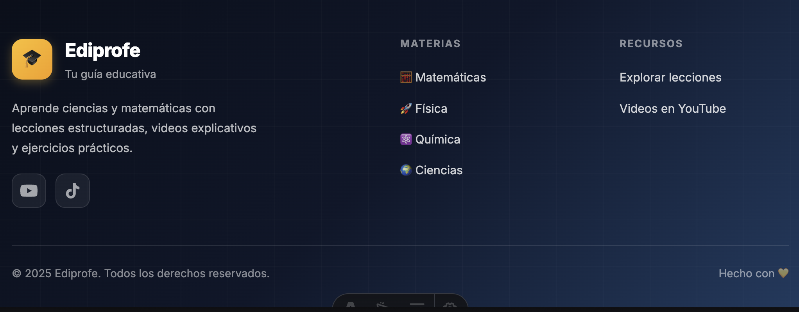
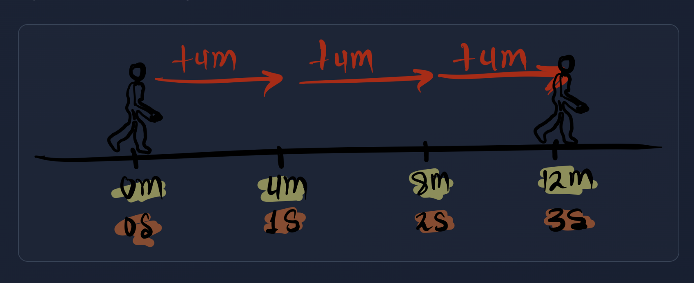

# 📋 PETICIÓN AL AGENTE

> **Este documento es tu punto de entrada.** Lee las instrucciones, las reglas críticas, y luego la petición del usuario al final.

---

## 🚀 INSTRUCCIONES RÁPIDAS

### Paso 1: Obtener contexto
```
LEE: CLAUDE.md (secciones relevantes según el tipo de tarea)
```

### Paso 2: Identificar tipo de tarea

| Si la petición es sobre... | Lee esta sección de CLAUDE.md |
|---------------------------|-------------------------------|
| **Crear lecciones nuevas** | "Flujo de trabajo en 5 etapas" |
| **Generar ilustraciones** | "Sistema de ilustraciones" + Árbol de decisión |
| **Modificar renderers Python** | "Módulo Core" + "Módulo Cartesian" |
| **Exportar a Word/PDF** | "Comandos útiles" |
| **Entender la estructura** | "Estructura del proyecto" |

### Paso 3: Consultar workflows específicos

| Tipo de ilustración | Workflow |
|---------------------|----------|
| Circunferencias | `.agent/workflows/circle-spec.md` |
| Triángulos | `.agent/workflows/geometry-exact.md` |
| Geometría analítica | `.agent/workflows/cartesian-spec.md` |
| Gráficas de funciones | `.agent/workflows/graphspec.md` |
| **Estadística (histogramas, barras)** | `.agent/workflows/mathplotter-spec.md` |
| **Sistemas de ecuaciones** | `.agent/workflows/mathplotter-spec.md` |
| Diagramas conceptuales | PNG de tablet (ver CLAUDE.md) |
| Química (tabla periódica) | `.agent/workflows/chemistry-spec.md` |
| Contenido educativo | `.agent/workflows/content-generation.md` |

---

## ⚠️ REGLAS CRÍTICAS (LEER SIEMPRE)

> **Estas reglas existen porque errores pasados requirieron refactorizaciones masivas. NO las ignores.**

### 🎨 1. COLORES: Nunca hardcodear

```python
# ❌ PROHIBIDO
color='#3b82f6'

# ✅ OBLIGATORIO
from core.colors import COLORS
color=COLORS['primary']
```

**Fuente de verdad:** `scripts/geometry/core/colors.py`

### 🏷️ 2. CONFIGURACIÓN: Usar centralizadas

```typescript
// ❌ PROHIBIDO
const materiaColor = '#ef4444';

// ✅ OBLIGATORIO
import { getMateriaConfig } from '../config/materias';
const config = getMateriaConfig('matematicas');
```

**Fuentes de verdad:**
- Materias: `src/config/materias.ts`
- Tipos: `src/types/content.ts`
- URLs: `src/utils/navigation-generator.js`

### 📐 3. LaTeX: Formato correcto

```markdown
<!-- ❌ PROHIBIDO -->
La fórmula es: $$A = \pi r^2$$ donde...

<!-- ✅ OBLIGATORIO -->
La fórmula es:

$$
A = \pi r^2
$$

Donde...
```

### 🖼️ 4. Contenedores SVG: Responsivos

```html
<!-- ❌ PROHIBIDO -->
<div style="max-width: 500px;">

<!-- ✅ OBLIGATORIO -->
<div style="width: 100%; box-sizing: border-box;">
```

### 📁 5. Metadatos: _meta.json obligatorio

Cada carpeta de tema DEBE tener:
```json
{
  "name": "Nombre con Tildes",
  "description": "Descripción breve"
}
```

### ✅ 6. Verificación: Ejecutar siempre

Después de modificar renderers:
```bash
bash scripts/verify-svg-rendering.sh
```

---

## 📊 TABLA RESUMEN DE FUENTES DE VERDAD

| Qué | Dónde | Importar |
|-----|-------|----------|
| Colores SVG | `scripts/geometry/core/colors.py` | `from core.colors import COLORS` |
| MathPlotter | `scripts/geometry/core/plotter.py` | `from scripts.geometry.core.plotter import MathPlotter` |
| Config materias | `src/config/materias.ts` | `getMateriaConfig()` |
| Tipos TypeScript | `src/types/content.ts` | `MateriaSlug`, `isMateriaSlug` |
| Helpers de URL | `src/utils/navigation-generator.js` | `cleanSlug()`, `cleanSegment()` |
| Tamaños canvas | `scripts/geometry/core/canvas.py` | `SIZE_SIMPLE`, `SIZE_COMPOUND` |
| **Navegación contextual** | `src/utils/navigation-loader.ts` | `loadContextualNavigation()`, `MATERIAS_LIST` |

---

## 🚫 ANTI-PATRONES (NO REPETIR)

| ❌ Error | ✅ Solución |
|---------|------------|
| Hardcodear colores hex | Usar `COLORS` de core |
| `max-width` fijo en SVG | Usar `width: 100%` |
| LaTeX en títulos | Usar texto plano |
| Usar tags HTML/JSX para imágenes | Usar Markdown `` |
| Crear `_meta.json` sin `name` | Siempre incluir `name` |
| Definir tipos localmente | Importar de `types/content` |

---

## 📋 CHECKLIST ANTES DE ENTREGAR

- [ ] ¿Usé las fuentes de verdad para colores/config?
- [ ] ¿Los contenedores SVG son responsivos?
- [ ] ¿El LaTeX está en bloques con líneas vacías?
- [ ] ¿Ejecuté la verificación de renderers?
- [ ] ¿Los `_meta.json` tienen `name`?

---

## 🔄 PROTOCOLO DE CLARIFICACIÓN

**Si NO tienes certeza de algo → PREGUNTA ANTES de ejecutar.**

Situaciones que requieren confirmación:
- Diagramas técnicos/visuales
- Primera vez haciendo algo de ese tipo
- Solicitud ambigua o con múltiples interpretaciones

---

# 📝 PETICIÓN DEL USUARIO

QUIERO QUE POR FAVOR EN LA PÁGINA DE INICIO
http://localhost:4322/, en la parte del footer, veo que están los enlaces de youtube y de tiktok duplicados. MEJORA ESO.

QUIERO TAMBIÉN QUE CORRIJAS EL COMPORTAMIENTO DE LAS TABLAS QUE SE MUESTRAN DESDE EL ARCHIVO .MD DE LECCIONES, PORQUE DA LA IMPRESIÓN EN ALGUNAS TABLAS, QUE CUANDO LA TABLA ES ANCHA, SE SALE COMO DEL CONTENEDOR, SE DESCUADRA TODO, TOCA HACER UN ZOOM OUT, Y SE VE HORRIBLE, SE DESCUADRA TODO, ESTO PASA MÁS QUE TODO EN MÓVIL, PORQUE HAY MENOS ESPACIO LÓGICAMENTE. QUIERO QUE ESTO LO CORRIJAS Y APLIQUES TIPO LA ESTRATEGIA QUE APLICA GITHUB EN SU WEB CUANDO SE TRATA POR EJEMPLO DE VER LOS ARCHIVOS MARKDOWN, QUE SE AJUSTAN BIEN, NO SÉ SI ME DOY A ENTENDER COMO ESTA ISSUE, ONFIRMAME POR FAVOR SI ENTENDISTE.


DE OTRO LADO, POR FAVOR MEJORES LA PÁGINA DE INICIO CUANDO NO HAY LECCIONES CARGADAS TODAVÍA, YA QUE  NO ME CONVENCE DEL TODO. O SEA QUE SEA COCNRETO Y CONCISA, PERO ALGO MÁS LLAMATIVA ESA PARTECITA DEL MENSAJE DE CONTENIDO EN PREPARACIÓN Y DEMÁS.

aplica buenas prácticas, lee toda la documentación en CLAUDE.md y no inventes lo que ya tiene un a función para resovlerse. adealante.

