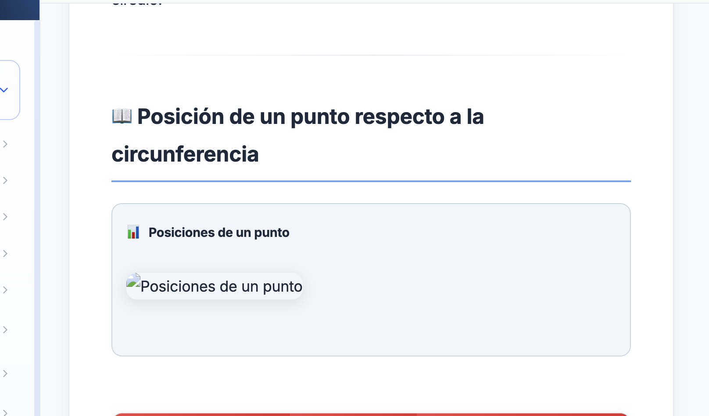

# GENERACIÓN DE ILUSTRACIONES PARA LAS LECCIONES

## Lo primero

LEE CLAUDE.md y sus documentos citados ahí para que obtengas el contexto general

RECUERDA QUE ESTAMOS CON LOS SVG DE LAS LECCIONES PERTENECIENTES A ESTE TEMA: http://localhost:4321/quimica/tabla-periodica

En esta lección necesito que, bien sea usando rough.js o svg (de preferencia), hagas las ilustraciones correspondientes que están en formato ASCI (o algo así), te doy un ejemplo: , en la lección: http://localhost:4321/quimica/tabla-periodica/propiedades-periodicas/radio-atomico... bueno así todas las que estén de ese tipo las vas a reemplazar por SVG (preferible) o por rough.js.

TODAS LAS DE LA LECCIÓN. PROCEDE.

