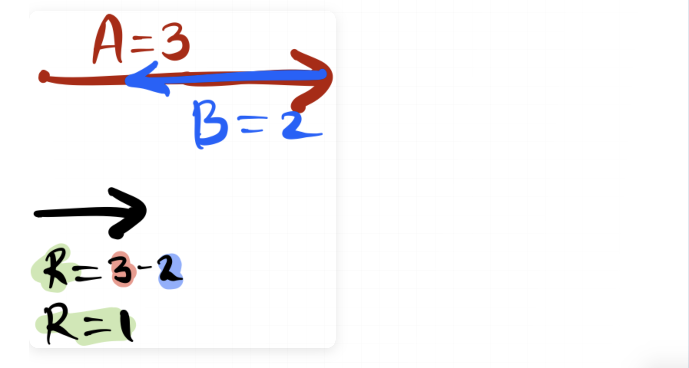

# 📋 PETICIÓN AL AGENTE

> **Este documento es tu punto de entrada.** Lee las instrucciones, las reglas críticas, y luego la petición del usuario al final.

---

## 🚀 INSTRUCCIONES RÁPIDAS

### Paso 1: Obtener contexto
```
LEE: CLAUDE.md (secciones relevantes según el tipo de tarea)
```

### Paso 2: Identificar tipo de tarea

| Si la petición es sobre... | Lee esta sección de CLAUDE.md |
|---------------------------|-------------------------------|
| **Crear lecciones nuevas** | "Flujo de trabajo en 5 etapas" |
| **Generar ilustraciones** | "Sistema de ilustraciones" + Árbol de decisión |
| **Modificar renderers Python** | "Módulo Core" + "Módulo Cartesian" |
| **Exportar a Word/PDF** | "Comandos útiles" |
| **Entender la estructura** | "Estructura del proyecto" |

### Paso 3: Consultar workflows específicos

| Tipo de ilustración | Workflow |
|---------------------|----------|
| Circunferencias | `.agent/workflows/circle-spec.md` |
| Triángulos | `.agent/workflows/geometry-exact.md` |
| Geometría analítica | `.agent/workflows/cartesian-spec.md` |
| Gráficas de funciones | `.agent/workflows/graphspec.md` |
| Diagramas conceptuales | PNG de tablet (ver CLAUDE.md) |
| Química (tabla periódica) | `.agent/workflows/chemistry-spec.md` |
| Contenido educativo | `.agent/workflows/content-generation.md` |

---

## ⚠️ REGLAS CRÍTICAS (LEER SIEMPRE)

> **Estas reglas existen porque errores pasados requirieron refactorizaciones masivas. NO las ignores.**

### 🎨 1. COLORES: Nunca hardcodear

```python
# ❌ PROHIBIDO
color='#3b82f6'

# ✅ OBLIGATORIO
from core.colors import COLORS
color=COLORS['primary']
```

**Fuente de verdad:** `scripts/geometry/core/colors.py`

### 🏷️ 2. CONFIGURACIÓN: Usar centralizadas

```typescript
// ❌ PROHIBIDO
const materiaColor = '#ef4444';

// ✅ OBLIGATORIO
import { getMateriaConfig } from '../config/materias';
const config = getMateriaConfig('matematicas');
```

**Fuentes de verdad:**
- Materias: `src/config/materias.ts`
- Tipos: `src/types/content.ts`
- URLs: `src/utils/navigation-generator.js`

### 📐 3. LaTeX: Formato correcto

```markdown
<!-- ❌ PROHIBIDO -->
La fórmula es: $$A = \pi r^2$$ donde...

<!-- ✅ OBLIGATORIO -->
La fórmula es:

$$
A = \pi r^2
$$

Donde...
```

### 🖼️ 4. Contenedores SVG: Responsivos

```html
<!-- ❌ PROHIBIDO -->
<div style="max-width: 500px;">

<!-- ✅ OBLIGATORIO -->
<div style="width: 100%; box-sizing: border-box;">
```

### 📁 5. Metadatos: _meta.json obligatorio

Cada carpeta de tema DEBE tener:
```json
{
  "name": "Nombre con Tildes",
  "description": "Descripción breve"
}
```

### ✅ 6. Verificación: Ejecutar siempre

Después de modificar renderers:
```bash
bash scripts/verify-svg-rendering.sh
```

---

## 📊 TABLA RESUMEN DE FUENTES DE VERDAD

| Qué | Dónde | Importar |
|-----|-------|----------|
| Colores SVG | `scripts/geometry/core/colors.py` | `from core.colors import COLORS` |
| Config materias | `src/config/materias.ts` | `getMateriaConfig()` |
| Tipos TypeScript | `src/types/content.ts` | `MateriaSlug`, `isMateriaSlug` |
| Helpers de URL | `src/utils/navigation-generator.js` | `cleanSlug()`, `cleanSegment()` |
| Tamaños canvas | `scripts/geometry/core/canvas.py` | `SIZE_SIMPLE`, `SIZE_COMPOUND` |

---

## 🚫 ANTI-PATRONES (NO REPETIR)

| ❌ Error | ✅ Solución |
|---------|------------|
| Hardcodear colores hex | Usar `COLORS` de core |
| `max-width` fijo en SVG | Usar `width: 100%` |
| LaTeX en títulos | Usar texto plano |
| `` dentro de `<div>` | Usar `` |
| Crear `_meta.json` sin `name` | Siempre incluir `name` |
| Definir tipos localmente | Importar de `types/content` |

---

## 📋 CHECKLIST ANTES DE ENTREGAR

- [ ] ¿Usé las fuentes de verdad para colores/config?
- [ ] ¿Los contenedores SVG son responsivos?
- [ ] ¿El LaTeX está en bloques con líneas vacías?
- [ ] ¿Ejecuté la verificación de renderers?
- [ ] ¿Los `_meta.json` tienen `name`?

---

## 🔄 PROTOCOLO DE CLARIFICACIÓN

**Si NO tienes certeza de algo → PREGUNTA ANTES de ejecutar.**

Situaciones que requieren confirmación:
- Diagramas técnicos/visuales
- Primera vez haciendo algo de ese tipo
- Solicitud ambigua o con múltiples interpretaciones

---

# 📝 PETICIÓN DEL USUARIO

1. Quiero por favor que esta sintaxis:

> 🎬 **Video:**
> [Ver en YouTube](https://youtu.be/kYNxFuNMGoI?si=RsyfOnN57TlmexjW)
> [Ver en TikTok](https://vt.tiktok.com/ZSBp743qq/)

en archivos mdx, como por ejemplo este @src/content/quimica/01-la-materia/01-conceptos-basicos/01-que-es-la-materia.mdx, produzca el youtube como un embebido que ocupe todo el ancho del contendor, y el link de tiktok se vuelva un hipervínculo normal, así como cualquier otro link. Es decir, el trato especial lo quiero es con el link de youtube.

2. Para un determinado tema de un CAPÍTULO, QIERO QUE CAMBIES LA NOTACIÓN EN TODA EL PROYECTO Y LUGARES E LA INTERFAZ, PARA QUE YA NO SE LLAME "CAPÍTULO" SINO "UNIDAD".

3. CADA UNIDAD VA A TENER UN LINK CON LA PLAYLIST DE LA UNIDAD EN YOUTUBE, QUIERO QUE ESE LINK DE LA PLAYLIST SE PUEDA INSERTAR EN EL _meta.json, y se pueda desplegar un hipervínculo en la tarjeta de presentación de la unidad, por ejemplo acá: http://localhost:4322/quimica/la-materia, , como rediseñar la tarjeta o la página de unidad (antigua capitulo) para que tenga ese link de la playlist disponible, que se va a sacar desde el _meta.json de la unidad. 

Quiero también que cuando se visite la página dentro de un tema, en una unidad específica, por ejemplo este tema:http://localhost:4322/fisica/introduccion-a-la-fisica/introduccion, se dé un espacio en el _meta.json para poner el link al pdf del tema, rediseñando la tarjeta o la página de tema, como tú veas que quede más bonito.

YA YO HICE EL EJERCICIO DE INSERTAR UN LINK DE PLAYLIST DE YOUTUBE AL _meta.json de esta unidad: http://localhost:4322/quimica/la-materia, y un link de pdf al _meta.json de este tema: http://localhost:4322/fisica/introduccion-a-la-fisica/introduccion, Para que pongas a prueba la imlementación con datos reales que ya tengo a la mano.

