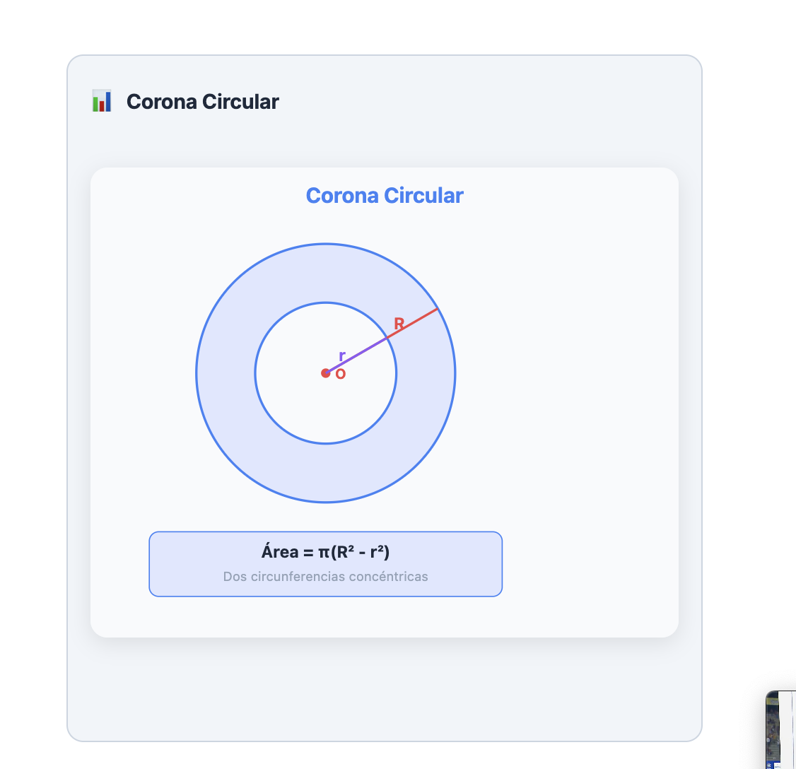
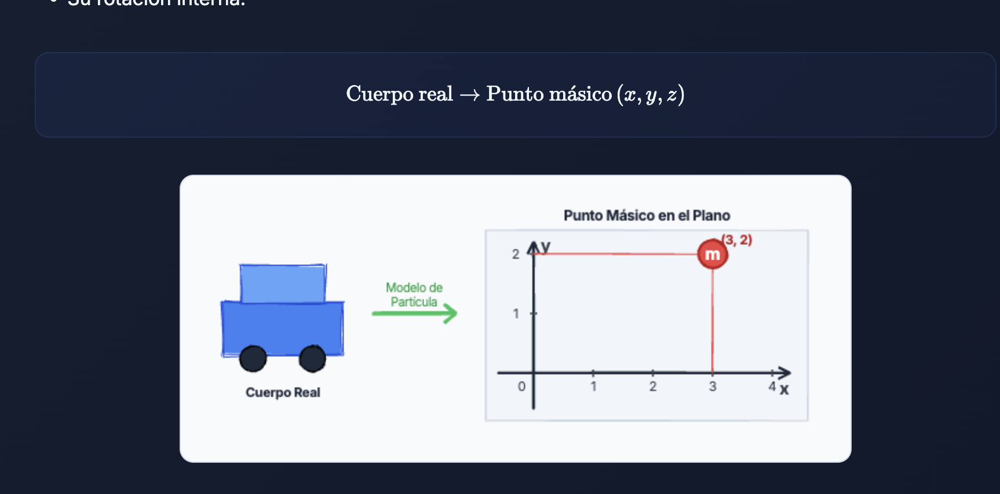
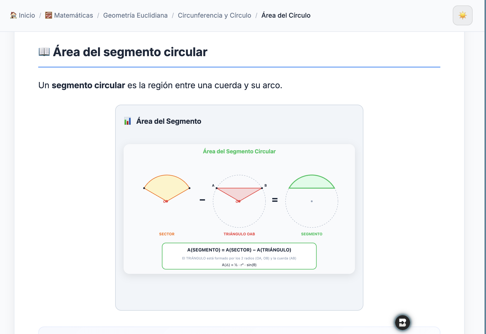
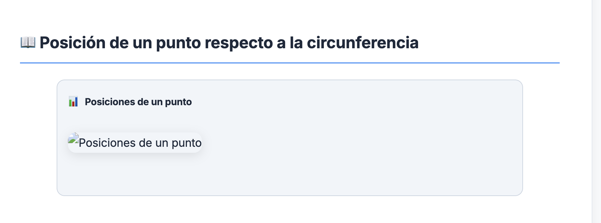
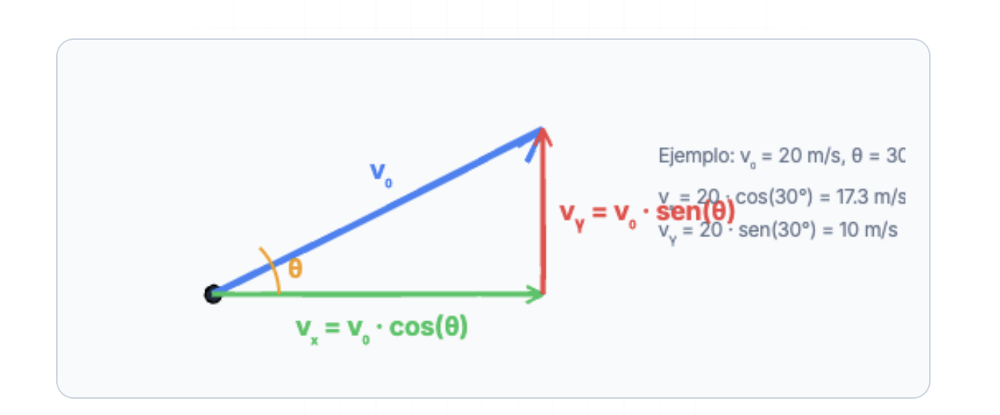
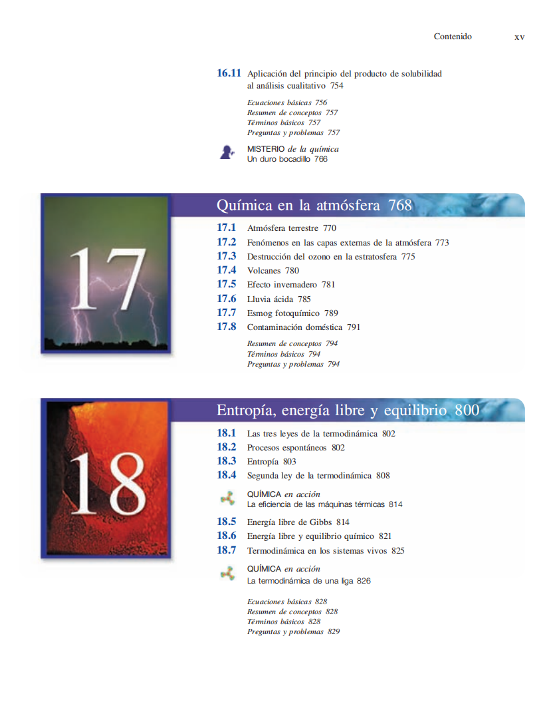
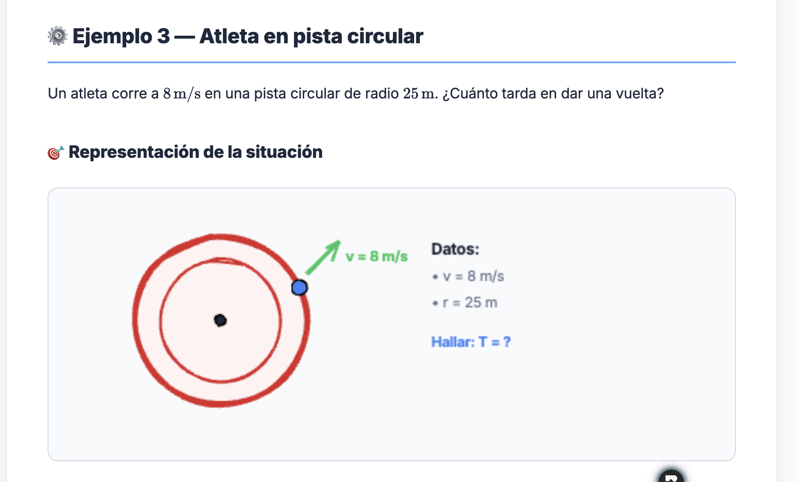
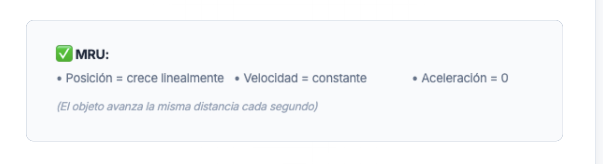
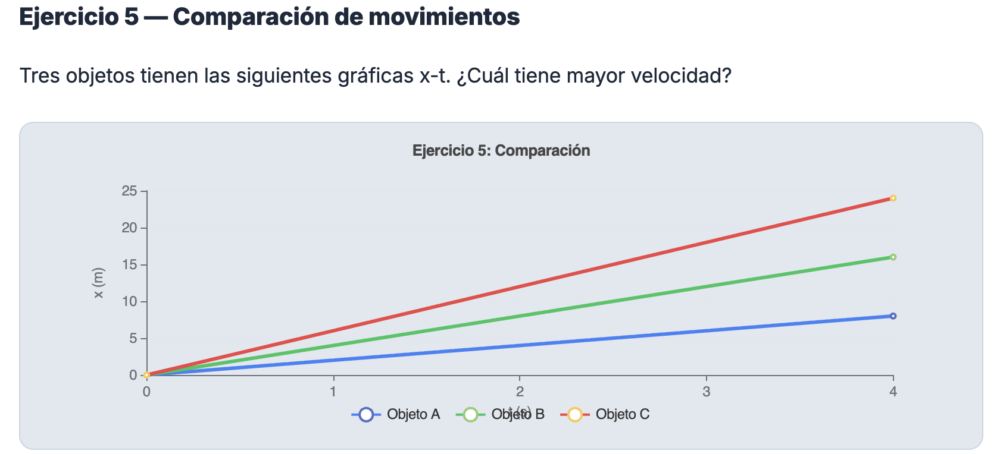
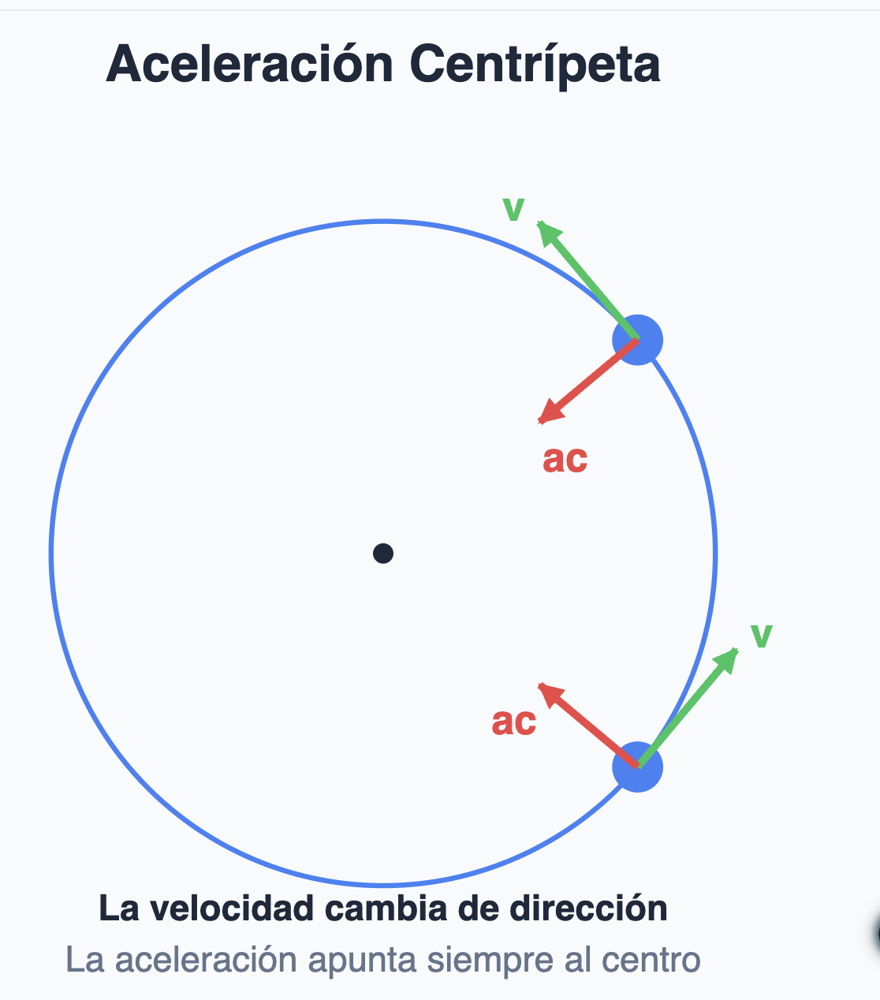

# PLANEACIÓN PEDAGÓGICA PARA CONSTRUIR EL ÁRBOL DE CARPETAS DE QUÍMICA

## Lo primero

LEE CLAUDE.md y sus documentos citados ahí para que obtengas el contexto general

## Objetivo

Crear el árbol de carpetas de química que se pueda usar en el curso de química.

## Consideración 

- Ya tengo un árbol creado con base en los videos. Es decir, ese contenido me lo ha entregado notebookLM con base en el contenido de los videos que yo he realizado. Es decir, la estructura actual refleja mi idea inicial sobre cómo debe etructurarse la materia, pero siento que aún le faltan cosas y tiene otras muchas mejorables. Sin embargo, te pidos que partas de esa idea general inicial, teniendo en cuenta claro está el orden de las otras fuentes de referencia que te voy a pasar, y para que temas que están ahí no se queden por fuera.

- La idea es que el curso naturalmente se pueda tomar en fases, es decir por ejemplo una fase del colegio y temas elementales que se ven en colegios de america latina, particularmente de Colombia. Y luego naturalmente se pueda hacer la transición a temas que quizás se tocan en la universiadad....todo guiado por una estructura muy clara y entendible.

- Tanto la estructura de carpetas como el contenido de las lecciones debe ser tal que, pueda ser tomado al pie de la letra (tanto en orden de las temáticas como en contenido de cada una de las lecciones), por el profesor más didáctico del colegio, que sea respetado por su alta capacidad de conectar temas de una manera simple, sin repetir conceptos o duplicarlos en su explicación, siendo muy conciso...bueno puedes ver los detalles en CLAUDE.md y archivos citados ahí (te pido que leas ese contexto primero).

- En algunos de los archivos ya creados y alimentados, te hago algunas consideraciones adicionales bajo el título "# COMENTARIO".

- Las referencias que te mando te vas a dar cuenta que cubren tema de más, eso es normal, quiero que consideres todo eso en el árbol de carpetas pero tengas en cuenta que la generación de lecciones la prioridad será sobre los temas más estandarizados. Algunos de esos temas o unidades por ejemplo que aparecen en el libro de chang queno tienen. ese nivel de prioridad son por ejemplo: metalurgia y la química, química y la atmosfera, polimeros, quimica nuclear, y bueno demás temas que tú mismo vas descartando para mirar en detalle o si sí o no dedicarles un tema.

- Te das cuenta que organización es como lo más cercano a lo que quiero, y sobre eso quiero que completes y des una estructura más natura, por supuesto que puedes cambiar cosas. La referencia de tutor.com es lo más cercano al estándar de los institutos y primeros semestres de universidad no solo a nivel de USA sino también america latina. El libro de chang es lo más amplio, para que lo tengas en consideración.

- Ejercicios puntuales que yo tenga en los archivos de lección .md no los cambies, dejálos tal cual (podrías cambiarle el número del ejemplo), pero no el contenido del ejercicio. Es más, la mayoría los vas a cambiar de "Ejercicio" a "Ejemplo", siguien lo lógica de las lecciones ya creadas en otras materias.

## Referencia del libro química de Chang - 10ma edición

Las partes en las que se habla de química moderna como tirando a física y demás no las vas a dar a detalle.

## Referencia de árbol de temas de tutor.com

Estos son los temas que da tutor.com y la agrupación que hace. Esta es una empresa norteamericana, pero e igual manera la pongo acá para tener en cuenta.

PROCEDE CON LA PROPUESTA DE ÁRBOL DE CARPETAS. NO GENERES LECCIONES TODAVÍA, SOLO EL ÁRBOL DE CARPETAS PROPUESTO. ADELANTE.

