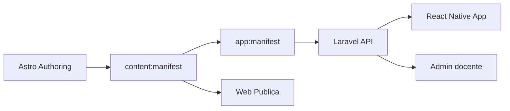
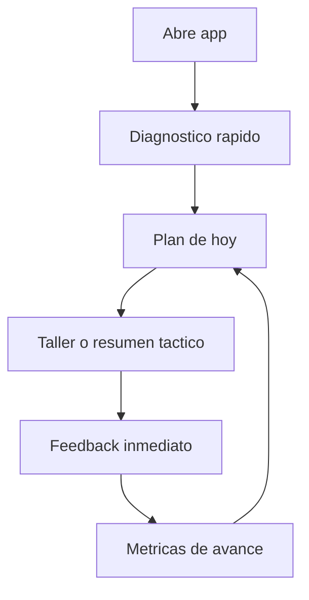

# App MVP Blueprint (No espejo de la web)

## Decision central
La web de Astro sigue como canal de contenido abierto y SEO.
La app movil se enfoca en entrenamiento y resultado.

- Web: teoria, autoridad, descubrimiento.
- App: practica, feedback, progreso y conversion a premium.

## Propuesta de valor de pago
Un estudiante paga por:
1. Simulacros y talleres tipo ICFES con cronometro.
2. Retroalimentacion accionable (texto corto + microvideo).
3. Plan de practica personalizado (que hacer hoy y por que).
4. Progreso visible por competencia/componente.

No paga por leer un texto largo que ya puede leer gratis en web.

## Arquitectura de producto


## Pipeline de publicacion recomendado
1. Creas contenido en `src/content` como hoy.
2. Exportas contrato general:
- `npm run content:manifest`
3. Ajustas estrategia app por overrides:
- `docs/new-features/samples/app-content-overrides.example.json`
4. Exportas contrato app:
- `npm run app:manifest`
5. Laravel sincroniza y expone catalogo a la app.

## Taxonomia app (MVP)
Modulos iniciales:
1. `tactical_summary` (gratis).
2. `workshop` (premium).
3. `theory_reference` (opcional para consulta breve).

Acceso:
- `free`: abierto.
- `premium`: requiere suscripcion o grant.

## Flujo del estudiante


## Pantallas MVP
1. Home (plan del dia + streak + progreso).
2. Biblioteca (filtros: area, unidad, modulo, nivel).
3. Sesion de practica (preguntas + timer + marcadores).
4. Resultado (errores, causa probable, recomendacion siguiente).
5. Premium (beneficios + compra + estado de acceso).

## Buenas practicas de implementacion
1. API versionada desde el inicio (`/api/v1`).
2. Contrato JSON versionado (`contractVersion`).
3. Offline-first en app: cache de catalogo + prefetch de assets preview.
4. Feature flags para activar modulos progresivamente.
5. Observabilidad: eventos de sesion, abandono, aciertos por competencia.
6. No acoplar UI mobile al markdown crudo; usar manifiesto derivado.

## Ejemplo concreto (tu caso)
Ruta actual en web:
- `/quimica/la-materia/resumen-unidad/resumen`

En app se convierte en tarjeta de `tactical_summary`:
- 5 ideas clave
- 3 errores comunes
- mini plan de 15 minutos
- 8 preguntas sugeridas

Y el taller:
- `/saber/quimica/la-materia/taller`

Se publica como `workshop` premium con feedback.

## Commandos
```bash
npm run content:manifest
npm run app:manifest
```

Salida por defecto:
- `/tmp/ediprofe-content-manifest.json`
- `/tmp/ediprofe-app-training-manifest.json`
