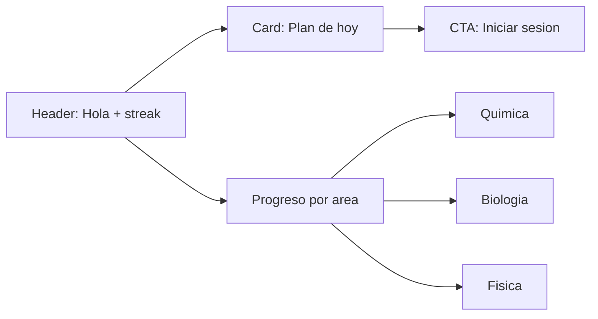
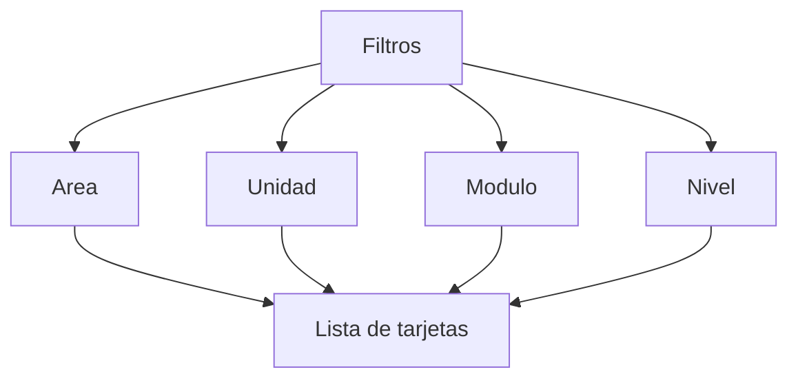
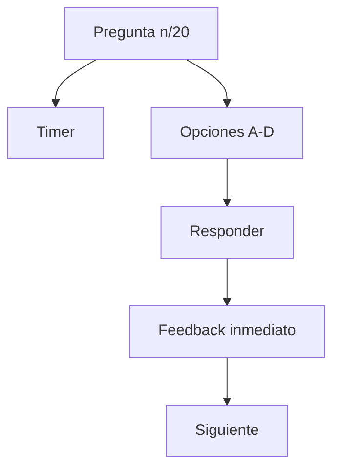
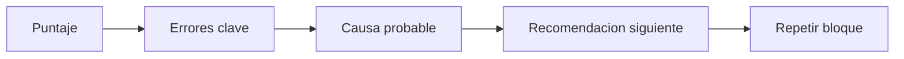

# App MVP Wireframes (Conceptual)

## 1) Home

## 2) Biblioteca

## 3) Sesion de practica

## 4) Resultado

## Nota
Estos wireframes son de flujo y jerarquia. El UI visual final se define en Figma/Excalidraw, pero el comportamiento ya queda definido por estos bloques.
