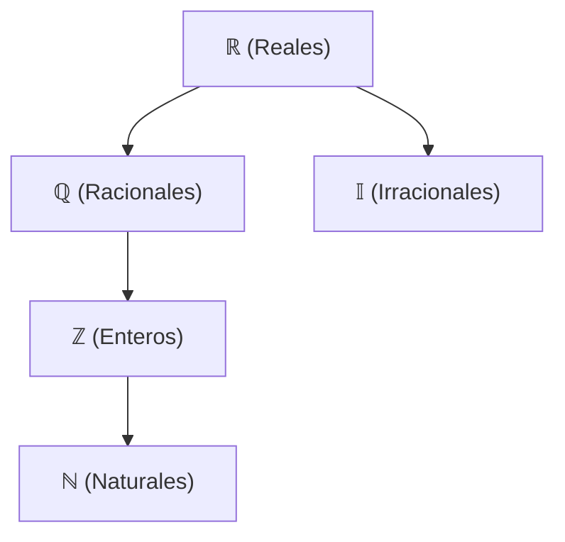

# Conjuntos Numéricos

---

## 🧩 Introducción

En matemáticas, los **conjuntos numéricos** son agrupaciones de números que comparten características comunes. Conocerlos nos permite entender qué operaciones podemos realizar y qué resultados esperar.

A lo largo de la historia, la necesidad de resolver distintos problemas llevó a la creación de nuevos conjuntos numéricos, cada uno más amplio que el anterior.

---

## 🔢 Números Naturales ($\mathbb{N}$)

Son los números que usamos para **contar**:

$$
\mathbb{N} = \{1, 2, 3, 4, 5, \ldots\}
$$

> [!NOTE]
> Algunos autores incluyen el cero en los naturales: $\mathbb{N}_0 = \{0, 1, 2, 3, \ldots\}$

### Características

- Son **infinitos** (no tienen fin).
- Son **positivos**.
- Permiten sumar y multiplicar libremente.

### Limitación

$5 - 8 = ?$ → No existe resultado en $\mathbb{N}$.

---

## ➖ Números Enteros ($\mathbb{Z}$)

Para resolver restas como $5 - 8$, se crearon los **números negativos**:

$$
\mathbb{Z} = \{\ldots, -3, -2, -1, 0, 1, 2, 3, \ldots\}
$$

### Incluye

| Tipo | Ejemplos |
|------|----------|
| Positivos | $1, 2, 3, \ldots$ |
| Cero | $0$ |
| Negativos | $-1, -2, -3, \ldots$ |

### Propiedad clave

$$
\mathbb{N} \subset \mathbb{Z}
$$

Todo número natural también es un número entero.

### Limitación

$3 \div 4 = ?$ → No existe resultado exacto en $\mathbb{Z}$.

---

## ➗ Números Racionales ($\mathbb{Q}$)

Son todos los números que pueden expresarse como **fracción** de dos enteros:

$$
\mathbb{Q} = \left\{ \frac{p}{q} \mid p, q \in \mathbb{Z}, \, q \neq 0 \right\}
$$

### Ejemplos

| Fracción | Decimal |
|----------|---------|
| $\frac{1}{2}$ | $0.5$ |
| $\frac{3}{4}$ | $0.75$ |
| $\frac{1}{3}$ | $0.\overline{3}$ |
| $-\frac{7}{2}$ | $-3.5$ |

### Incluye

- Todos los enteros (ej: $5 = \frac{5}{1}$)
- Decimales exactos ($0.25$)
- Decimales periódicos ($0.\overline{6}$)

### Propiedad clave

$$
\mathbb{N} \subset \mathbb{Z} \subset \mathbb{Q}
$$

### Limitación

$\sqrt{2} = ?$ → No puede expresarse como fracción.

---

## √ Números Irracionales ($\mathbb{I}$)

Son números con decimales **infinitos no periódicos**:

$$
\mathbb{I} = \{ x \mid x \notin \mathbb{Q} \}
$$

### Ejemplos famosos

| Número | Valor aproximado |
|--------|------------------|
| $\sqrt{2}$ | $1.41421356\ldots$ |
| $\pi$ | $3.14159265\ldots$ |
| $e$ | $2.71828182\ldots$ |
| $\sqrt{3}$ | $1.73205080\ldots$ |

### Característica

**No pueden expresarse como fracción** de dos enteros.

---

## 📐 Números Reales ($\mathbb{R}$)

La **unión** de racionales e irracionales forma los números reales:

$$
\mathbb{R} = \mathbb{Q} \cup \mathbb{I}
$$

### Incluye

- Todos los naturales
- Todos los enteros
- Todas las fracciones
- Todos los irracionales

### Representación

Cada número real corresponde a un **punto único** en la recta numérica.

```
←──────┼──────┼──────┼──────┼──────┼──────→
      -2     -1      0      1      2
```

---

## 🔄 Diagrama de Inclusión

Los conjuntos se relacionan así:

$$
\mathbb{N} \subset \mathbb{Z} \subset \mathbb{Q} \subset \mathbb{R}
$$

$$
\mathbb{I} \subset \mathbb{R}
$$



---

## 🧾 Tabla Resumen

| Conjunto | Símbolo | Descripción | Ejemplos |
|----------|---------|-------------|----------|
| Naturales | $\mathbb{N}$ | Para contar | $1, 2, 3, 100$ |
| Enteros | $\mathbb{Z}$ | Incluye negativos | $-5, 0, 42$ |
| Racionales | $\mathbb{Q}$ | Fracciones | $\frac{1}{2}, -3.5$ |
| Irracionales | $\mathbb{I}$ | No son fracciones | $\sqrt{2}, \pi$ |
| Reales | $\mathbb{R}$ | Toda la recta | Todos los anteriores |

---

## ✅ Cómo clasificar un número

1. **¿Es positivo y sirve para contar?** → $\mathbb{N}$
2. **¿Es entero (positivo, negativo o cero)?** → $\mathbb{Z}$
3. **¿Puede escribirse como fracción?** → $\mathbb{Q}$
4. **¿Es decimal infinito no periódico?** → $\mathbb{I}$
5. **¿Está en la recta numérica?** → $\mathbb{R}$

---

## 🧪 Ejemplos de clasificación

| Número | $\mathbb{N}$ | $\mathbb{Z}$ | $\mathbb{Q}$ | $\mathbb{I}$ | $\mathbb{R}$ |
|--------|:----:|:----:|:----:|:----:|:----:|
| $7$ | ✓ | ✓ | ✓ | ✗ | ✓ |
| $-3$ | ✗ | ✓ | ✓ | ✗ | ✓ |
| $0$ | ✗* | ✓ | ✓ | ✗ | ✓ |
| $\frac{2}{5}$ | ✗ | ✗ | ✓ | ✗ | ✓ |
| $\sqrt{5}$ | ✗ | ✗ | ✗ | ✓ | ✓ |
| $\pi$ | ✗ | ✗ | ✗ | ✓ | ✓ |

*Depende de la convención adoptada.

---
